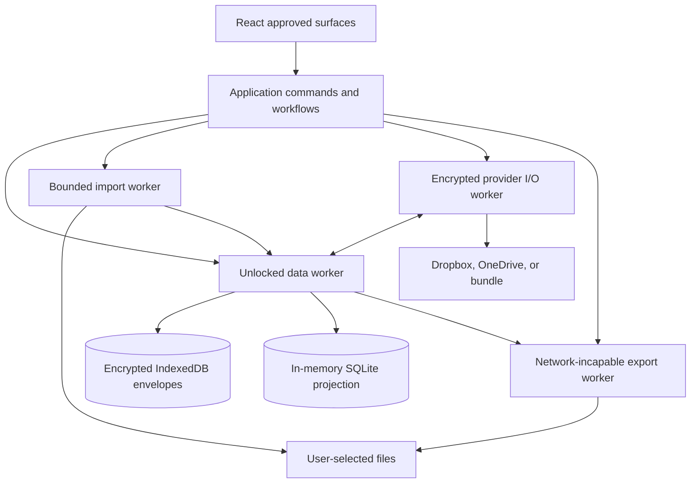
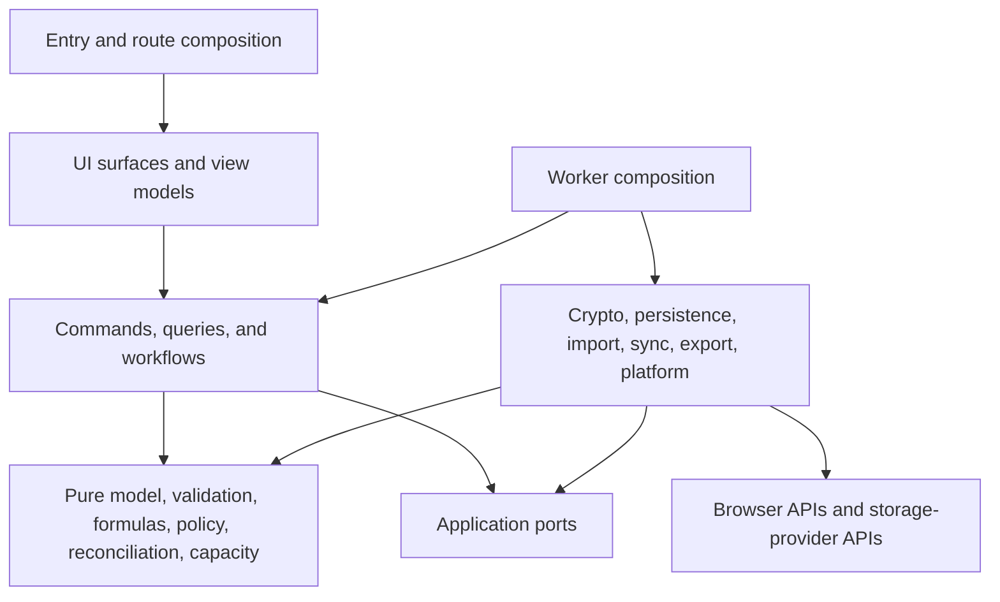
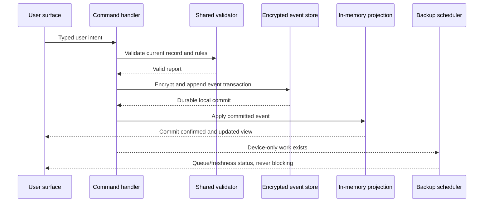

# Architecture — Sheaf

> **Phase:** architecture 
> **Status:** draft for builder approval — one requirements clarification 
> **Decision date:** 2026-09-08 
> **Inputs:** ./program/sheaf/specs/idea.md, ./program/sheaf/specs/requirements.md, and ./program/sheaf/specs/design.md

Sheaf is a **static, installable, local-first web application**. All product
logic runs in the browser. The local encrypted event store is authoritative;
cloud providers carry immutable ciphertext for durability and reconciliation,
never a remotely served working database. There is no Sheaf API, account
service, analytics collector, relay, function, or backend.

The architecture deliberately separates four representations:

1. **Encrypted durable envelopes** persist locally and in a durable home.
2. **Domain events and baselines** express user-authored truth and merge
   history.
3. **An unlocked, in-memory relational projection** supports fast queries,
   formulas, relationships, and charts without persisting plaintext.
4. **View models** expose only the currently needed unlocked data to React.

That separation is load-bearing. A provider adapter never sees plaintext, a
UI component never writes storage directly, and a merge result can never
bypass the validator used by ordinary edits.

---

## Stack Decision

| Layer | Technology | Rationale |
|---|---|---|
| Primary language | **TypeScript 6.0**, strict ESM | Stable toolchain support, exhaustive domain unions, browser APIs, and one language across UI, workers, parsers, sync, and tests. TypeScript 7 is deferred until its programmatic API and dependent lint/test tooling are stable together. |
| UI runtime | **React 19.2** | Mature component ecosystem, predictable client-only rendering, strong accessibility tooling, and a clean fit for the exhaustive screen inventory. No React Server Components are used. |
| Routing | **React Router 8 in declarative hash-history mode** | Hash routes survive generic static hosting and keep provider redirects at the site root without rewrite rules. Routes compose approved surfaces; they do not own domain behavior. |
| Accessible primitives | **React Aria Components 1.x**, selectively wrapped | Supplies keyboard, focus, overlay, collection, and screen-reader behavior while leaving the visual system fully custom. Native controls remain native where the design requires them. |
| Styling | **Vanilla CSS, CSS Modules, cascade layers, and CSS custom properties** | Directly models the shell/app semantic token split, keeps themes runtime-cheap, and avoids coupling the production system to the mocks' Tailwind CDN. |
| Workflow state | **XState 5** for long-running workflows; React state for ephemeral view state | Import, OAuth, adoption, backup, reset, and conflict resolution are explicit, resumable state machines. The local event store—not a client state library—is the source of truth. |
| Persistent local database | **IndexedDB through Dexie 4**, storing encrypted opaque envelopes only | Broad phone-browser support, transactions, quota reporting, multi-tab coordination, and no custom encrypted filesystem/VFS. No plaintext user projection is persisted. |
| Query projection | **Official SQLite 3 WASM in a dedicated worker, in-memory only, with FTS5 enabled** | Dynamic relational tables, joins, filters, sorting, and aggregates are much simpler and safer in SQL internally. Terminating the worker drops plaintext, keys, and indexes together. No SQL is exposed to users. |
| Cryptography | **libsodium.js/WASM**: Argon2id, XChaCha20-Poly1305, HKDF/HMAC primitives, and CSPRNG | A small versioned suite covers passphrase derivation, authenticated encryption, key wrapping, streaming bundles, and tamper detection without inventing crypto. |
| Binary encoding | **Canonical CBOR** with an explicit codec version; compression before encryption for large segments | Compact, deterministic envelopes make migrations, hashing, fixtures, and provider-neutral bundles practical. |
| Workbook containers | **zip.js** random-access/stream APIs for OPC/ODS containers; a bounded custom CFB sector reader for legacy XLS | Reads metadata and selected entries from Blob slices without putting the whole workbook in the JS heap. It supports the pre-flight-before-cell-parse contract. |
| Workbook interpretation | **Format-specific TypeScript adapters** for OOXML, XLSB, BIFF/XLS, ODS, and delimited text | No available monolithic browser parser simultaneously meets streaming, declared-structure fidelity, safe macro refusal, and preservation requirements. Shared parsing primitives are reused, but fidelity stays explicit per format. |
| Formula engine | **A Sheaf-owned parser, typed formula IR, dependency graph, and evaluator**; no JavaScript eval | Stable table/column identities replace A1 references. The owned function catalog makes live, frozen, unsupported, and clock-volatile behavior testable. |
| Charts | **Chart.js 4.x** fed by bounded worker-produced datasets, plus a Sheaf-owned text/table alternative | Covers bar, line, pie, scatter, and stacked charts with touch hit-testing. Accessibility and partial-data truth remain product-owned rather than delegated to canvas. |
| Export | **SheetJS Community Edition, export-only**, plus pdf-lib and browser Canvas/Blob APIs | SheetJS is suitable for generated XLSX/CSV output but is not used for import because its browser reader buffers complete workbook bytes. PDF and PNG remain entirely client-side. |
| PWA | **Web App Manifest + Workbox InjectManifest service worker** | Pre-caches versioned public assets and supports offline launch while leaving lifecycle, migration, and update policy under Sheaf's control. User data never enters Cache Storage. |
| Build | **Vite 8.2**, Node.js 24 LTS, pnpm with a frozen lockfile | Fast static ESM/WASM/worker builds, deterministic chunks, and no runtime server. |
| Unit/property tests | **Vitest 5 + fast-check** | Fast pure-domain tests and property testing for reconciliation, codecs, parser bounds, and cryptographic state transitions. |
| Browser/end-to-end tests | **Playwright**, axe-core, and real-device smoke tests | Verifies service workers, IndexedDB, workers, OAuth return handling, offline behavior, responsive layouts, and assistive semantics in actual engines. |
| Deployment target | **Static-only Cloudflare Pages reference deployment**, with Pages Functions, Workers, analytics, and runtime injection disabled | Supports HTTPS, immutable assets, security headers, SPA root redirects, and zero application backend. The output remains portable to any equivalent static host. |

All direct dependencies are pinned to exact versions in the lockfile. WASM
artifacts are built or vendored into the static output; no library, font,
worker, parser, or script is loaded from a third-party CDN at runtime.

---

## Architectural Invariants

1. **Local commit precedes acknowledgement.** A successful create, edit,
   delete, schema change, theme change, chart save, or conflict resolution is
   acknowledged only after its encrypted event commits in one IndexedDB
   transaction.
2. **Interactive work never waits for a provider.** Launch, read, write,
   validation, formulas, query, chart, history, and export use local state.
3. **Plaintext has a narrow lifetime.** It exists only inside an unlocked
   worker and the minimum UI view models needed to render the current surface.
   Locking terminates workers and discards those objects.
4. **Persistent storage is generic and opaque.** User names, schema, record
   values, snapshots, formulas, charts, themes, account labels, tokens,
   baselines, change counts, and backup times are encrypted payloads. Clear
   storage is limited to format versions, KDF salts/parameters, random
   per-envelope storage identifiers, padded byte buckets, and transactional
   revision counters. Clear identifiers never map one-to-one to a domain app,
   table, record, or event.
5. **One validator owns every acceptance path.** CRUD, restore, import
   promotion, schema impact, automatic merge, manual conflict repair, and
   adoption validation call the same domain validator.
6. **One reconciler owns every divergence path.** Device sync, offline queues,
   and workbook re-upload all use the same three-way reconciliation policy.
7. **Computed facts are not authored facts.** Deterministic computed values are
   projected, not logged as user changes. TODAY and NOW are never persisted.
   Frozen nondeterministic imports and unsupported-formula imported values are
   explicit literals with provenance.
8. **No imported behavior executes.** Macros cause whole-import refusal;
   formulas run only through the bounded interpreter; HTML, scripts, external
   links, embedded objects, and SVG are never executed.
9. **Cloud commits are generation commits.** Immutable encrypted chunks land
   first; a conditional manifest-head update is last. Failure before the last
   step leaves the previous confirmed generation readable.
10. **Approved design surfaces are the UI boundary.** Route and overlay
    composition uses the screen, modal, sheet, control, and state inventories
    in ./program/sheaf/specs/design.md. A genuinely missing surface is a
    design-fill request, not an implementation invention.
11. **Deletion markers do not expire automatically.** They remain in the
    encrypted vault index indefinitely, so a device offline for an unknown
    duration cannot silently resurrect or silently lose an app.
12. **No egress by default.** Production CSP and an application-level network
    guard allow only selected provider authorization/storage hosts. Tests fail
    on every unexpected request.

---

## Durable-Home Qualification Decision

The requirements make Google Drive conditional on architecture verification.
This phase resolves that condition.

| Home | Discovery | Isolation | Static public-client authorization | Decision |
|---|---|---|---|---|
| Dropbox App Folder | The same Dropbox user and app registration can enumerate the app folder. | App Folder access is confined to that user's /Apps/Sheaf namespace. | Authorization Code + PKCE supports public JavaScript clients, and offline access can issue a refresh token. | **Ship. Primary provider.** |
| OneDrive App Folder | The same Microsoft account can list the constant /me/drive/special/approot location across devices. | Delegated Files.ReadWrite.AppFolder intersects the signed-in user's rights and is limited to the app folder. | SPA Authorization Code + PKCE is supported. Its 24-hour refresh-token window requires a top-level silent/interactive renewal and a truthful reconnect state. | **Ship. Secondary provider.** |
| Google Drive drive.file | Per-file scope can list files the app created and is non-sensitive. | OAuth access is user-scoped. | Google's browser-only token model returns short-lived tokens and requires a user-driven event to obtain another. Google's code model requires a backend to exchange and retain refresh tokens. That violates the approved no-backend, public-client-PKCE, debounced-backup contract. | **Drop as a durable home.** |
| Google Drive appDataFolder | Cross-device enumeration is technically possible. | App-scoped and user-scoped. | Same authorization problem as above. It also intentionally hides contents from the user's Drive UI, violating the visibility constraint. | **Drop as a durable home.** |
| Encrypted bundle file | Opened by hand; it promises no discovery. | The selected file is self-contained and encrypted. | No OAuth. | **Ship. Manual-only.** |
| iCloud Drive | Available through the platform picker for import and save destinations. | Not applicable. | No third-party web storage API meeting discovery. | **Upload/save destination only; never a durable home.** |

Evidence:

- Dropbox documents App Folder confinement, PKCE for pure-JavaScript/public
  clients, and refresh tokens in its
  [OAuth guide](https://developers.dropbox.com/oauth-guide).
- Microsoft documents the constant app-root path, cross-device use, and
  least-privilege app-folder boundary in
  [Using app folder in OneDrive and SharePoint](https://learn.microsoft.com/en-us/graph/onedrive-sharepoint-appfolder),
  and the SPA PKCE/24-hour renewal behavior in its
  [authorization-code flow](https://learn.microsoft.com/en-us/entra/identity-platform/v2-oauth2-auth-code-flow).
- Google classifies drive.file as narrow/non-sensitive in
  [Choose Google Drive API scopes](https://developers.google.com/workspace/drive/api/guides/api-specific-auth),
  but its [browser token model](https://developers.google.com/identity/oauth2/web/guides/use-token-model)
  requires a user gesture for a replacement access token, while its
  [code model](https://developers.google.com/identity/oauth2/web/guides/use-code-model)
  sends the exchange and refresh-token custody to a backend.
- Google explicitly describes appDataFolder as hidden from the user in
  [Store application-specific data](https://developers.google.com/workspace/drive/api/guides/appdata).

The production UI therefore does not enable the conditional Google Drive card
shown in the design mocks. Google Drive remains usable through the operating
system's file picker as an upload source. Reconsidering it later requires a
provider-contract re-entry after Google offers a compliant browser public-client
flow; widening Drive scope or adding a backend is not an acceptable workaround.

---

## Alternatives Considered

| Decision | Chosen | Rejected | Why |
|---|---|---|---|
| Application shape | Client-only React SPA/PWA | Next.js server runtime, native apps, Electron | A server contradicts the product boundary; separate native clients multiply implementation and reconciliation risk; Electron does not solve phone use. |
| Routing | Hash history | Required static-host rewrites | Hash routes make deep links and OAuth return handling portable across truly static hosts. |
| Persistent store | Encrypted envelopes in IndexedDB | Plain SQLite in OPFS; SQLCipher/custom encrypted VFS; localStorage | Plain SQLite violates at-rest encryption. A custom page-encryption VFS is security-critical complexity. localStorage is synchronous, small, and unsuitable for binary/event data. |
| Query engine | Ephemeral SQLite WASM | Persisted relational projection; hand-written array scans only; DuckDB WASM | Persisted plaintext is forbidden. Array scans become hard to bound for joins/sorts. DuckDB is larger and optimized for analytics rather than CRUD projections. |
| Import | Bounded random-access format adapters | SheetJS/ExcelJS as the primary importer; server conversion | Whole-buffer browser readers fail the streaming rule and do not expose all required structures. A conversion server is forbidden and would receive plaintext. |
| Formula execution | Owned AST/IR interpreter | eval/new Function; HyperFormula; storing calculated values | Dynamic JavaScript is unsafe. HyperFormula's licensing/semantic surface is not a safe default for this public product. Stored computed values create needless conflicts and violate volatile-value rules. |
| Merge model | Three-way event reconciliation with retained baselines | Last-write-wins, two-way diff, whole-document replacement, generic CRDT | Each rejected model can overwrite user truth, mishandle stale inputs, or bypass the explicit key/delete conflict policy. |
| Workflow management | XState for multi-stage flows | Global Redux store; ad-hoc effect chains | The difficult state is lifecycle state, not remote server cache. Explicit machines make cancellation, retry, resume, and destructive gates auditable. |
| UI primitives | React Aria wrapped in Sheaf styles | A visually opinionated component suite; mock Tailwind CDN | The approved visual language is bespoke. The architecture needs behavior and accessibility primitives, not another theme. |
| Background work | Unlocked-page workers plus resume retry | Correctness dependent on unload, Periodic Background Sync, or service-worker-held keys | Mobile termination is unreliable, background APIs vary, and long-lived keys must not be placed in the service worker. |
| Cloud write shape | Immutable chunks + conditional head | Overwrite one bundle on every save; in-place mutation | Generation commits preserve a prior readable backup through interrupted uploads and give concurrent writers a CAS point. |
| Deletion retention | Permanent encrypted marker | Time-based garbage collection | No finite timer proves every offline device has observed the deletion. The marker is tiny; correctness wins. |
| Google Drive | Omitted | drive.file, appDataFolder, broad Drive scope, backend token broker | The narrow visible option lacks compliant browser refresh; the app-data option is hidden; broad scope and a backend violate approved boundaries. |
| Production CSS | CSS Modules/tokens | Tailwind runtime/CDN, CSS-in-JS runtime | Static CSS minimizes offline/runtime surface and directly represents per-app semantic tokens. |
| Deployment | Static Pages output | Functions, Workers, API routes, SSR | There is no server-owned operation to run, and adding one would create a data-egress and availability boundary. |

---

## Supported Runtime Baseline

Support is **feature-gated, not user-agent guessed**.

- **Phone/tablet:** Safari on iOS/iPadOS 17 or newer; Chromium 120 or newer;
  Firefox Android 122 or newer.
- **Desktop:** Safari 17 or newer; current and previous two stable releases of
  Chromium, Edge, and Firefox.
- **Required capabilities:** secure context, IndexedDB, Web Crypto primitives
  used by the sodium WASM bootstrap, WebAssembly, dedicated workers,
  service workers, transferable ArrayBuffers, Blob slicing/streams, and
  platform file input.
- **Optional capabilities:** Web Share with files, File System Access save
  picker, Storage Persistence, Background Sync, and install-prompt events.
  Each enhances a flow but is never a correctness dependency.
- **Capability failure:** before local setup, SCR-001 renders the approved
  recoverable-error control state and names the missing browser capability.
  It does not create a new unapproved screen.
- **Storage persistence:** Sheaf requests persistent storage when available,
  but never equates a granted browser hint with durability. The durable home
  remains the only durability claim.

The service worker and encrypted database have independent version checks.
The application never opens user data under an incompatible codec/migration
version merely because the public shell updated successfully.

### Inbound share/open-in feasibility finding

- **Approved behavior:** FR-1 and EXT-002 require a workbook handed to Sheaf
  from another application to enter the ordinary import flow.
- **Demonstrated implementation:** installed Chromium PWAs can register a file
  receiver through the
  [Web Share Target API](https://developer.chrome.com/docs/capabilities/web-apis/web-share-target).
  Desktop Chromium can additionally use manifest file handlers.
- **Demonstrated mismatch:** WebKit still has an open, unimplemented
  [Web Share Target issue](https://bugs.webkit.org/show_bug.cgi?id=194593);
  current iOS/iPadOS home-screen web apps cannot register as a system share
  destination. A static PWA cannot polyfill an operating-system registration.
- **Bounded implementation:** on supporting Chromium platforms, the service
  worker receives the POST, generates a one-time key, streams the workbook into
  a dedicated encrypted transient inbox, and transfers the key by same-origin
  MessagePort to the launched page. The page holds it only in memory through
  local unlock, then the data worker re-encrypts the source into ordinary
  import staging. Lost handoffs are cryptographically erased and direct the
  user to the file picker. On WebKit, Sheaf offers the platform file picker
  (including Files/iCloud locations) but must not claim to be a share target.
- **Required clarification:** the current web-only architecture can satisfy
  EXT-002 only where the platform exposes share-target/file-handler support.
  Universal iOS share-sheet presence would require a signed native wrapper and
  share extension, contradicting the static-PWA/no-paid-infrastructure
  constraints. This is a requirements clarification, not an adapter still to
  be selected.

---

## Module Structure

Every path below is a leaseable ownership boundary. Parent directories are
organizational only and do not imply shared ownership.

### Entry, composition, and platform

| Path | Responsibility |
|---|---|
| ./program/sheaf/src/main.tsx | Minimal browser entry: load public configuration, mount the root, and register fatal bootstrap handling. |
| ./program/sheaf/src/bootstrap/ | Capability checks, lock/unlock runtime lifetime, dependency composition, worker startup/termination, and lifecycle signals. |
| ./program/sheaf/src/routes/ | Hash-route definitions, route guards, approved screen composition, and OAuth return routing. |
| ./program/sheaf/src/platform/ | File/open-in acquisition, save/share handoff, date/tel/maps navigation, install prompt, visibility, and storage-estimate adapters. |
| ./program/sheaf/src/config/ | Validated public build configuration, provider client IDs/redirects, allowed origins, format versions, and feature flags. |
| ./program/sheaf/src/pwa/ | Manifest, service worker, precache policy, Chromium share-target receiver, transient encrypted share inbox, offline fallback, and safe-update coordination. |

### UI modules

| Path | Responsibility and approved surfaces |
|---|---|
| ./program/sheaf/src/ui/primitives/ | CTL-001–120 behavior wrappers and semantic states; React Aria/native composition only, with no product workflow. |
| ./program/sheaf/src/ui/layout/ | Compact, wide, tablet-split, and desktop-rail layouts; safe areas, sticky regions, and focus order. |
| ./program/sheaf/src/ui/theme/ | Shell tokens, generated-app token mapping, contrast enforcement, mode/density/logo presentation. |
| ./program/sheaf/src/ui/security/ | SCR-001–009 plus MOD-020–024, MOD-032–033, and MOD-037: setup, lock/recovery/reset, scoped secrets, and recovery codes. |
| ./program/sheaf/src/ui/library/ | SCR-010–015, MOD-003, and SHT-011: shell tile states, library search, durable-home list, discovery, install education, and tile actions. |
| ./program/sheaf/src/ui/import/ | SCR-016–023, SCR-043–045, MOD-004–008, MOD-034–035, and SHT-013: upload, pre-flight, progress, refusal, review, re-upload, identity, and evidence. |
| ./program/sheaf/src/ui/records/ | SCR-024–032 except chart-specific content; MOD-009–011; and SHT-001–010/SHT-016: app home, table/query, record forms/detail, snapshots, and history. |
| ./program/sheaf/src/ui/charts/ | SCR-033–034, MOD-012–013, and SHT-012/SHT-017: chart rendering/builder, mark interaction, save/pin, and accessible alternatives. |
| ./program/sheaf/src/ui/schema/ | SCR-035–037, MOD-014–015, and SHT-014: schema, rule, formula, theme, and app-settings editors. |
| ./program/sheaf/src/ui/durability/ | SCR-038–042; MOD-001–002, MOD-016–019, MOD-025–026, and MOD-036; and SHT-015: reminders, providers, backup, adoption, and capacity doors. |
| ./program/sheaf/src/ui/reconciliation/ | SCR-046–048 and SHT-018: pending queue, three-way comparisons, record repair, special conflicts, and applied log. |
| ./program/sheaf/src/ui/ownership/ | SCR-049–052 and MOD-027–031: plaintext export, local removal, delete-everywhere, and deletion-marker rescue. |

### Application and domain modules

| Path | Responsibility |
|---|---|
| ./program/sheaf/src/application/ports/ | Interfaces for local transactions, projections, crypto, providers, files, clocks, entropy, lifecycle, and budget probes. |
| ./program/sheaf/src/application/commands/ | Command authorization, validation orchestration, event creation, transactional commit, and post-commit acknowledgement. |
| ./program/sheaf/src/application/queries/ | Typed query requests, pagination/partial-result policy, relationship traversal, history, metrics, and chart datasets. |
| ./program/sheaf/src/application/workflows/ | XState machines for setup, unlock/recovery/reset, import/re-upload, OAuth, backup, adoption, export, removal, and deletion. |
| ./program/sheaf/src/application/view-models/ | Converts domain/query results into screen-specific, plaintext-minimized UI models and announcements. |
| ./program/sheaf/src/domain/model/ | Stable opaque IDs, app/schema/record/chart/theme concepts, source provenance, event unions, baseline references, and domain errors. |
| ./program/sheaf/src/domain/validation/ | Column rules, record rules, referential integrity, schema compatibility, impact analysis, and one shared validation report. |
| ./program/sheaf/src/domain/formulas/ | Formula parser, stable-reference IR, function catalog, dependency graph, cycle detection, evaluator, and volatility policy. |
| ./program/sheaf/src/domain/reconciliation/ | Three-way comparison, automatic-merge eligibility, key/delete/schema conflict classification, validation handoff, pending cases, and applied audit entries. |
| ./program/sheaf/src/domain/capacity/ | Five independent budget models, calibration, estimates, state transitions, named degradation, and remedies. |
| ./program/sheaf/src/domain/policy/ | Pure cross-cutting policies: scratch reminders, backup freshness, removal consequences, account isolation, and allowed actions by local/listed state. |

### Local persistence and cryptography

| Path | Responsibility |
|---|---|
| ./program/sheaf/src/crypto/ | KDF calibration, key hierarchy, recovery-code handling, envelope/stream encryption, authenticated key wrapping, zeroization hooks, and cipher-suite versioning. |
| ./program/sheaf/src/persistence/envelope-store/ | Dexie database ownership, encrypted blob/event/staging transactions, clear operational headers, quota-safe writes, and multi-tab revision notices. |
| ./program/sheaf/src/persistence/projection/ | Unlocked in-memory SQLite lifecycle, event replay, lazy table hydration, FTS/query plans, and projection invalidation. |
| ./program/sheaf/src/persistence/codecs/ | Canonical CBOR types, compression, envelope framing, checksums, and forward/backward codec readers. |
| ./program/sheaf/src/migrations/ | Ordered local database, envelope, event, projection, and vault-format migrations produced by the DB phase. No other module writes migration logic. |

### Import and inference

| Path | Responsibility |
|---|---|
| ./program/sheaf/src/import/source/ | Random-access source abstraction over File/Blob and encrypted staged chunks; content sniffing independent of extension. |
| ./program/sheaf/src/import/preflight/ | Metadata-only sizing, archive/CFB safety bounds, macro/unsafe-format detection, sheet inventory, device estimate, and selection plan before cell parsing. |
| ./program/sheaf/src/import/formats/ooxml/ | Streaming XLSX/OPC relationships, cells, formulas, styles, formats, validations, tables, charts, pivots, drawings, and unsupported-part inventory. |
| ./program/sheaf/src/import/formats/xlsb/ | Streaming XLSB record parsing with the same normalized fact contract and macro-sheet detection. |
| ./program/sheaf/src/import/formats/biff/ | Bounded random-access CFB and BIFF/XLS records, code pages, formats, formulas, validations, objects, and VBA/XLM refusal signals. |
| ./program/sheaf/src/import/formats/ods/ | Streaming ODS content/styles/validation/formula/chart facts and preserved unsupported objects. |
| ./program/sheaf/src/import/formats/delimited/ | Chunked CSV/TSV delimiter/encoding detection, row iteration, and value-only facts for new or existing apps. |
| ./program/sheaf/src/import/formats/html-table/ | Non-executing HTML table tokenization for legacy exports disguised as XLS; safe text/table facts only. |
| ./program/sheaf/src/import/inference/ | Header/region/table classification, types, enums, keys, relationships, record rules, formulas, metrics, charts, evidence, and remembered rejection decisions. |
| ./program/sheaf/src/import/snapshots/ | Normalized read-only sheet snapshots, encrypted original-source chunks, inert-content inventory, and safe render data. |
| ./program/sheaf/src/import/staging/ | Provisional encrypted import model, cancellation cleanup, review edits, explicit-accept promotion, and no-partial-app guarantee. |

### Durable homes and reconciliation transport

| Path | Responsibility |
|---|---|
| ./program/sheaf/src/sync/protocol/ | Provider-neutral vault header/index, immutable segment layout, generation head, CAS/retry, compaction publication, tombstones, and adoption manifests. |
| ./program/sheaf/src/sync/scheduler/ | Debounce, manual backup, visibility-triggered best effort, resume retry, continuous discovery while unlocked, and truthful status transitions. |
| ./program/sheaf/src/sync/providers/dropbox/ | Dropbox PKCE/token lifecycle, account identity, App Folder list/download/upload-session/CAS operations, and error translation. |
| ./program/sheaf/src/sync/providers/onedrive/ | Microsoft SPA PKCE/token lifecycle, account identity, approot/Graph list/download/upload-session/CAS operations, renewal, and error translation. |
| ./program/sheaf/src/sync/providers/bundle/ | Manual encrypted bundle assembly, save/open validation, vault-secret prompt contract, and staleness semantics. |
| ./program/sheaf/src/sync/adoption/ | Index-only discovery, pre-download sizing, selective payload transfer, local validation, atomic adoption, and listed-only refusal. |
| ./program/sheaf/src/sync/coordinator/ | Pull/push orchestration, event-set comparison, baseline selection, reconciliation invocation, pending/applied persistence, and confirmed-head accounting. |

### Export and worker boundaries

| Path | Responsibility |
|---|---|
| ./program/sheaf/src/export/ | Plaintext XLSX/CSV/PNG/PDF generation after acknowledgement, complete-local-data scope, cancellation, and platform save/share delivery. |
| ./program/sheaf/src/workers/data.worker.ts | Owns unlocked keys, event replay, validation, formulas, in-memory SQLite, commands, queries, compaction, and local reconciliation. |
| ./program/sheaf/src/workers/import.worker.ts | Owns pre-flight and selected-sheet parsing/inference with bounded memory and cancellation. |
| ./program/sheaf/src/workers/io.worker.ts | Owns provider authorization and encrypted provider/bundle byte transfer, ciphertext hashing, and resumable I/O without access to record plaintext. |
| ./program/sheaf/src/workers/export.worker.ts | Owns plaintext artifact generation in a short-lived, network-incapable worker that is terminated after save/share completion. |
| ./program/sheaf/src/workers/protocol/ | Versioned typed RPC messages, cancellation, progress, transfer ownership, error redaction, and worker capability negotiation. |

### Test ownership

| Path | Responsibility |
|---|---|
| ./program/sheaf/tests/unit/ | Pure domain, workflow, codec, policy, and adapter unit tests. |
| ./program/sheaf/tests/property/ | Reconciliation, validation, crypto-envelope, event-order, and parser-bound property tests. |
| ./program/sheaf/tests/fixtures/workbooks/ | Hand-authored and application-generated fidelity corpus for every accepted/refused format and edge case. |
| ./program/sheaf/tests/fixtures/vaults/ | Versioned encrypted known-answer vaults, segments, bundles, tombstones, and migration fixtures. |
| ./program/sheaf/tests/browser/ | Real-browser database, worker, service-worker, lifecycle, offline, quota, and multi-tab tests. |
| ./program/sheaf/tests/e2e/ | Approved user flows and responsive/accessibility assertions against the design inventory. |
| ./program/sheaf/tests/provider-contract/ | Recorded/local protocol doubles plus opt-in live Dropbox and OneDrive qualification suites. |
| ./program/sheaf/tests/performance/ | Reference-device import, storage, query, chart, sync, memory, and abrupt-termination budgets. |
| ./program/sheaf/tests/security/ | Egress allowlist, CSP, malicious workbook, tamper, KDF, secret lifetime, and plaintext-at-rest probes. |

---

## Module Contracts

### Browser bootstrap

- **Owns:** Runtime capability decision, lock lifetime, worker composition, and
  lifecycle fan-out.
- **Exports:** AppBootstrap, CapabilityReport, UnlockedSession, LockReason.
- **Depends on:** ./program/sheaf/src/config/,
  ./program/sheaf/src/platform/, ./program/sheaf/src/pwa/, and
  ./program/sheaf/src/workers/protocol/.
- **Must not:** Read user records, call a provider, or retain a key after
  locking.

### Routes

- **Owns:** The mapping between URLs and approved SCR surfaces, guards for
  cold-lock/unlocked/app-present states, and provider callback return.
- **Exports:** RouteTable, RouteGuardResult, ScreenLocation.
- **Depends on:** UI feature modules and application view models.
- **Must not:** Implement commands, infer state from provider availability, or
  create a surface missing from ./program/sheaf/specs/design.md.

### UI primitives, layout, and theme

- **Owns:** Accessible interactions, semantic visual states, responsive
  composition, focus restoration/trapping, app token application, and
  announcements.
- **Exports:** Wrapped controls corresponding to CTL IDs, layout shells,
  ThemeVariables, StatusPresentation.
- **Depends on:** React Aria, React, and screen-safe view-model types only.
- **Must not:** Import persistence, crypto, parser, or provider code. Safety
  semantics cannot be recolored or renamed by an app theme.

### UI feature modules

- **Owns:** Rendering and local interaction for the SCR/MOD/SHT/STA inventory
  assigned in Module Structure.
- **Exports:** Route components and typed user intents.
- **Depends on:** UI primitives/layout/theme plus
  ./program/sheaf/src/application/view-models/.
- **Must not:** Acknowledge a save before receiving CommitConfirmed, calculate
  merge eligibility, or hide partial/broken/stale states.

### Application ports

- **Owns:** Dependency inversion contracts.
- **Exports:** LocalEventRepository, ProjectionEngine, CryptoPort,
  DurableHomePort, FilePort, ClockPort, EntropyPort, CapacityProbe,
  LifecyclePort.
- **Depends on:** Domain types only.
- **Must not:** Contain a browser, database, provider, or UI implementation.

### Commands

- **Owns:** The only user-authored mutation entrance.
- **Exports:** executeCommand, Command, CommandResult, CommitConfirmed.
- **Depends on:** domain policy/model/validation/formulas and application
  ports.
- **Contract:** Validate current state, authorize the action, create immutable
  event(s), encrypt and commit atomically, update the unlocked projection, then
  acknowledge. A provider result is never in this critical path.

### Queries

- **Owns:** Safe internal query plans and truthful bounded results.
- **Exports:** QueryRequest, QueryPage, PartialScope, RelationshipResult,
  MetricResult, ChartDataset, HistoryPage.
- **Depends on:** domain capacity/model and ProjectionEngine.
- **Contract:** Every partial response carries the known included scope,
  omitted scope/count when knowable, cause, and remedy. Export never consumes
  a partial query result.

### Workflows

- **Owns:** Explicit lifecycle state for long operations and destructive
  confirmation gates.
- **Exports:** SetupMachine, UnlockMachine, ImportMachine, ReuploadMachine,
  ProviderConnectMachine, BackupMachine, AdoptionMachine, ExportMachine,
  RemovalMachine, ResetMachine.
- **Depends on:** commands, queries, ports, and domain policies.
- **Contract:** State-machine snapshots contain no record values and are
  encrypted if persisted for resumption.

### View models

- **Owns:** Minimum-data projections for approved surfaces and accessible
  announcements.
- **Exports:** one discriminated view model per SCR surface and overlay family.
- **Depends on:** application queries/workflows and domain presentation-safe
  types.
- **Contract:** Locked view models never include an app name, count, backup
  time, or silhouette derived from decrypted data.

### Domain model

- **Owns:** Stable identities and immutable semantic facts.
- **Exports:** AppId, TableId, FieldId, RecordId, ChartId, EventId, DeviceId,
  DomainEvent, Provenance, BaselineRef, DurableHomeKind, LocalityState.
- **Depends on:** nothing outside the domain.
- **Contract:** User-facing names are values, never identifiers. IDs are random
  and stable across rename, re-upload, backup, and adoption.

### Validation

- **Owns:** Type, required, enum, relationship, cross-field, schema, and merge
  validation.
- **Exports:** ValidationRuleIR, ValidationContext, ValidationReport,
  validateRecord, validateSchemaTransition, analyzeImpact.
- **Depends on:** domain model and formula result types.
- **Contract:** The exact same validateRecord implementation is called for an
  authored write, restore, automatic merge, manual repair, and adoption
  replay. A caller cannot opt out of referential or cross-field checks.

### Formulas

- **Owns:** Parsing imported expressions, translating them to stable IDs,
  dependency ordering, recalculation, and fidelity disposition.
- **Exports:** FormulaAst, FormulaIR, FormulaDisposition, DependencyGraph,
  EvaluationResult, FunctionCatalog.
- **Depends on:** domain model only.
- **Contract:** No eval or dynamic module loading. Each function has a version,
  determinism class, input/output contract, and evaluation budget. Unsupported
  functions preserve original text and imported value; new rows get an empty
  flagged result.

### Reconciliation

- **Owns:** The mapping from baseline/local/incoming to automatic changes,
  pending conflicts, and the applied log.
- **Exports:** ReconcileInput, MergePlan, PendingConflict, RecordConflict,
  AppliedMerge, ResolutionEvent.
- **Depends on:** domain model, validation, and policy.
- **Contract:** Baseline absence sends every difference to the user. A
  same-field two-sided difference, contested key/FK, delete/edit, incompatible
  schema, or invalid merged record is never auto-applied. One-sided and
  different-field merges are provisional until full-record validation passes.

### Capacity

- **Owns:** Independent ImportBudget, StorageBudget, QueryBudget, ChartBudget,
  and SyncBudget decisions.
- **Exports:** BudgetVector, BudgetEstimate, BudgetState, CapacityDoor,
  DegradationNotice.
- **Depends on:** domain model and abstract device measurements.
- **Contract:** Locality is independent of size. Crossing storage capacity for
  data already present yields oversized-local; failing before adoption yields
  listed-only.

### Domain policy

- **Owns:** Cross-feature decisions that must not drift between screens.
- **Exports:** allowedActions, backupFreshness, removalDisposition,
  scratchReminderSchedule, providerAccountBoundary.
- **Depends on:** domain model/capacity.
- **Contract:** A change count of zero and a configured home are different
  facts; reversible removal is allowed only from a confirmed zero count.

### Cryptography

- **Owns:** All clear-key creation/derivation/use and every encrypted envelope.
- **Exports:** LocalRootKeyHandle, VaultKeyHandle, AppKeyHandle,
  EncryptedEnvelope, WrappedKey, KdfDescriptor, RecoveryCode,
  encryptEnvelope, decryptEnvelope.
- **Depends on:** libsodium and platform entropy only.
- **Contract:** Callers receive opaque key handles, not exportable key bytes.
  Same passphrase reuse across local/vault scopes still derives different keys
  through independent salts and domain-separated context.

### Envelope store

- **Owns:** The only persistent local database connection.
- **Exports:** appendEncryptedEvents, readEncryptedSnapshot,
  writeStagingChunk, promoteStaging, commitCompaction, purgeApp,
  subscribeRevision, estimateUsage.
- **Depends on:** Dexie, persistence codecs, migration runner, and encrypted
  envelope types.
- **Contract:** Transactions never accept plaintext domain objects. Promotion,
  compaction, adoption, and destructive deletion are pointer swaps: old state
  remains valid until the new state is committed.

### Projection

- **Owns:** Plaintext relational state for the current unlocked session.
- **Exports:** hydrateApp, applyEvents, executeQuery, createExportCursor,
  disposeProjection.
- **Depends on:** SQLite WASM, domain event/formula/validation types.
- **Contract:** Runs only in ./program/sheaf/src/workers/data.worker.ts. It
  persists nothing and is destroyed on lock. Export cursors are bounded,
  sequential reconstructions from encrypted checkpoints/events; they traverse
  complete local data without requiring interactive app entry or a fully
  hydrated projection, so oversized-local export remains available.

### Persistence codecs

- **Owns:** Wire/storage representation, not semantic decisions.
- **Exports:** encodeCanonical, decodeVersioned, frameSegment, unframeSegment,
  compressBounded, CodecVersion.
- **Depends on:** canonical CBOR and compression implementation.
- **Contract:** Decoders are size/depth bounded and reject duplicate or unknown
  critical fields. Migration occurs before a decoded event reaches domain
  code.

### Migrations

- **Owns:** Every durable format transition.
- **Exports:** MigrationPlan, migrateLocalStore, migrateEnvelope,
  migrateVaultIndex, migrateProjectionSchema.
- **Depends on:** old/new codecs and transactional persistence ports.
- **Contract:** Idempotent, crash-safe, fixture-backed, and never deletes the
  last readable copy before verifying the replacement. Exact schemas belong to
  the DB phase.

### Import source and pre-flight

- **Owns:** Content truth and the strict boundary before cell data.
- **Exports:** RandomAccessSource, DetectedFormat, PreflightReport,
  SheetInventory, ImportSelectionPlan, Refusal.
- **Depends on:** platform file port and domain capacity.
- **Contract:** It may read magic bytes, archive/CFB directories, workbook
  globals, sheet names, declared dimensions/tables, and macro indicators. It
  must not iterate sheet cells. It measures actual decompressed bytes through
  capped readers rather than trusting declared ZIP sizes.

### Format adapters

- **Owns:** Format syntax and fidelity facts only.
- **Exports:** a shared stream of WorkbookFact values plus
  PreservedPartDescriptor and ImportDiagnostic.
- **Depends on:** import source primitives and codecs; never UI or persistence.
- **Contract:** Each adapter is incremental and cancellable. Unsupported
  content emits a preserved descriptor; it is never silently ignored. A macro
  signal aborts the whole import before staging promotion.

### Import inference

- **Owns:** Evidence-weighted proposals, not source parsing.
- **Exports:** ProposedApp, InferenceStatement, Evidence, RejectionMemory,
  RowIdentityProposal.
- **Depends on:** normalized workbook facts and domain formula/validation/model.
- **Contract:** Declared tables/rules/formats beat inference; lookup formulas
  beat key-name matching; every decision carries evidence and a reversible
  review edit. Rejected relationships are stored as explicit negative
  decisions.

### Snapshots and staging

- **Owns:** Complete preservation and the transaction boundary around import.
- **Exports:** SheetSnapshotChunk, InertContentItem, ProvisionalImport,
  PromotionReceipt, cleanupImport.
- **Depends on:** crypto and encrypted envelope-store ports.
- **Contract:** Original source bytes are retained in encrypted chunks for
  fidelity/re-export support, while safe normalized snapshots are separately
  renderable. Cancellation/refusal deletes the provisional key and all staging
  references; no app tile is created.

### Sync protocol

- **Owns:** Provider-neutral encrypted storage layout and atomic-generation
  algorithm.
- **Exports:** VaultHeader, VaultIndex, AppManifest, EncryptedSegment,
  GenerationHead, DeletionMarker, PublishPlan.
- **Depends on:** crypto/codecs and DurableHomePort.
- **Contract:** Clear headers contain only KDF/cipher/version material and
  random IDs. Encrypted indexes contain names, metadata, wrapped app keys,
  segment sets, backup facts, and permanent deletion markers.

### Provider adapters

- **Owns:** OAuth, provider account identity, network requests, conditional
  revision semantics, resumable transfer, and provider error taxonomy.
- **Exports:** DurableHomePort implementations.
- **Depends on:** config, crypto-protected token storage port, browser fetch,
  and sync protocol byte streams.
- **Contract:** Accept and return bytes plus opaque metadata only. They cannot
  import domain record/schema types. Account ID from the provider scopes every
  connection; shared/team roots and sharing endpoints are never traversed.

### Sync scheduler and coordinator

- **Owns:** When to try and how to reconcile.
- **Exports:** BackupStatusStream, DiscoveryStream, SyncRunResult,
  DeviceOnlyCount.
- **Depends on:** sync protocol/adapters, reconciliation, validation,
  envelope store, and lifecycle/capacity ports.
- **Contract:** Status time advances only after provider acknowledgement of the
  new generation head. Offline, token, quota, CAS, and interruption failures
  leave local work usable and the prior remote generation readable.

### Adoption

- **Owns:** Remote-index-to-local transition.
- **Exports:** ListedApp, AdoptionEstimate, AdoptionResult.
- **Depends on:** sync protocol/provider, capacity, crypto, envelope store,
  codecs, and validation.
- **Contract:** Discovery downloads only encrypted index/sizing metadata.
  Payload begins only after explicit selection and a passing storage estimate.
  Promotion is atomic and does not invoke import, inference, or review.

### Export

- **Owns:** The deliberate boundary from encrypted/local data to user-directed
  plaintext.
- **Exports:** ExportPlan, ExportProgress, PlaintextArtifact.
- **Depends on:** complete projection cursors, chart renderer, SheetJS
  export APIs, pdf-lib, and platform save/share.
- **Contract:** Generation cannot begin until the exact format/scope
  acknowledgement is accepted. Data arrives in transferable bounded batches
  from a complete export cursor, including for oversized-local apps. No
  plaintext artifact is persisted inside Sheaf's database or Cache Storage.
  Listed-only apps cannot call this module.

### Workers and RPC

- **Owns:** Thread boundaries, key confinement, cancellation, progress, and
  transfer semantics.
- **Exports:** DataWorkerClient, ImportWorkerClient, IoWorkerClient,
  ExportWorkerClient, and versioned request/response/event unions.
- **Depends on:** application/domain/infrastructure composition appropriate to
  each worker.
- **Contract:** The data worker is the sole owner of the main IndexedDB
  database and produces or consumes encrypted sync segments. The service
  worker may write only the separate, transient, ciphertext-only share inbox.
  The IO worker accepts ciphertext and provider credentials only. The export worker has plaintext artifact scope
  but no network capability. UI messages contain view models, not repository
  objects. Errors crossing the boundary are redacted of cell values unless the
  current approved surface explicitly needs the value.

---

## Runtime Topology

Only provider IO crosses the network boundary, and it receives encrypted
provider segments plus session-scoped provider credentials—never record
plaintext or app keys. Import receives user-selected local files but has no
provider or general network capability. Export receives scoped plaintext rows
but is built without fetch/network imports and is terminated after handoff.
The service worker normally caches public build assets only. Its single data
exception is the optional Chromium inbound-share receiver: it encrypts the
posted file into an isolated transient inbox under a one-time memory-only key,
then transfers that key to the launched same-origin client by MessagePort. It
never receives a local root/app key or opens the main envelope database.

---

## Dependency Flow

The arrows mean "may import/use." Domain never points outward. Presentation
never imports infrastructure. Provider-specific types stop inside their
adapter.

---

## Local Write and Read Flow

If validation fails, no event is written. If the IndexedDB transaction fails,
the UI does not display "Saved." Projection updates are replayable effects of a
committed event; they are not the durable write.

---

## Local Key Hierarchy and At-Rest Format

### Local store

1. Initial setup generates a random 256-bit **local root key**.
2. The local unlock passphrase derives a wrapping key with Argon2id.
3. The separately generated local recovery code derives a second wrapping key
   through domain-separated HKDF.
4. Both wrapping keys independently wrap the same local root key. The recovery
   code itself is also stored encrypted under that root so it can be re-viewed
   only after this device is unlocked.
5. Each app has a random 256-bit app key. The local root key wraps app keys;
   app keys encrypt app events, snapshots, schema, formulas, themes, charts,
   baselines, and source chunks.
6. Provider tokens, account labels, vault-key handles, backup timestamps,
   device-only counts, and workflow resumes are encrypted with keys derived
   from the local root key.

A passphrase change re-derives a wrapper and re-wraps the local root key. It
does not rewrite app data. Local recovery unwraps that same root and installs a
new passphrase wrapper. A locked reset removes the database and key headers;
it never contacts or deletes a durable home.

### Vaults

1. Each durable home has an independent Argon2id salt and vault key.
2. The vault key encrypts the vault index and wraps app keys.
3. An app key encrypts all app segments; moving a scratch app into a vault
   wraps its existing app key and requires no data re-encryption.
4. A vault recovery code independently unwraps the vault key and is never the
   local recovery code. A re-viewable copy is encrypted inside the unlocked
   vault (and inside an unlocked device that has adopted the vault).
5. Reusing the same human passphrase for local and vault setup still produces
   unrelated keys through different salts and domain labels.

### Cipher profile

- **Passphrase KDF:** Argon2id v1.3, minimum 64 MiB memory, three iterations,
  one lane, calibrated upward to approximately 500–800 ms on the reference
  phone without going below that floor.
- **Recovery code:** 256 random bits, grouped Base32 with checksum; HKDF-SHA-256
  derives its wrapping key. It is displayed once at creation and can be
  re-viewed only while its scope is unlocked.
- **AEAD:** XChaCha20-Poly1305 with a fresh 192-bit random nonce per envelope.
- **AAD:** product ID, cryptographic scope, random storage-envelope ID, codec
  version, cipher-suite version, and logical revision. Semantic AppId, TableId,
  RecordId, and object kind remain inside ciphertext.
- **Large streams:** fixed-size chunks, each independently authenticated and
  bound to its ordinal and total-stream descriptor; a final authenticated
  manifest prevents truncation/reordering.
- **Key bytes:** confined to worker memory and zeroized best-effort before the
  worker terminates. No key or provider token goes to localStorage,
  sessionStorage, URL parameters, logs, crash text, or Cache Storage.

The KDF header, salt, nonce, cipher version, random per-envelope IDs, and
padded size buckets are not secret. Everything that could populate a library tile or reveal
workbook meaning is ciphertext.

After five failed unlocks, delay doubles from two seconds to a one-hour cap and
resets only after a successful unlock; the authenticated attempt record is
persisted where practical. These client-side delays satisfy the product
interaction rule but are defense in depth: an attacker able to rewrite the browser
profile can clear them. Argon2id and passphrase entropy are the offline
brute-force boundary; the UI must not imply otherwise.

---

## Encrypted Event and Projection Model

The exact database schema belongs to the DB phase. Architecturally, the store
must support these categories without persisting a domain-specific plaintext
table:

- **System header:** local format/KDF descriptors and wrapped local-root copies.
- **Opaque catalog:** random app/storage IDs and encrypted catalog payloads.
- **Immutable encrypted events:** record, schema, rule, formula, chart, theme,
  home, resolution, and deletion events.
- **Encrypted compacted snapshots:** a verified projection checkpoint plus
  the tail events needed to advance it.
- **Encrypted reconciliation baselines:** per row and counterpart/import
  lineage, retained while any future comparison needs them.
- **Encrypted import staging:** source chunks, normalized facts, review edits,
  and provisional app state.
- **Encrypted provider state:** tokens, account identity/label, vault headers,
  known generations, upload cursors, and confirmed acknowledgements.
- **Clear operational metadata:** codec/KDF version, random per-envelope key,
  padded byte bucket, and monotonic transaction revision only. Envelope rows
  are batched so their count cannot be used by the locked UI as an app or
  record inventory.

On unlock, the data worker decrypts the catalog and library read model. On app
entry it creates a fresh SQLite in-memory database, loads schema and the
minimum table chunks, replays the event tail, registers FTS/relationship
indexes, and builds formula dependencies. Other tables and snapshots hydrate
lazily. On lock, the worker is terminated rather than attempting to scrub an
unknown object graph in place.

Compaction writes a new encrypted checkpoint and retained-baseline set beside
the old generation, verifies replay/hash equivalence, then atomically swaps the
local pointer. It may collapse intermediate history but cannot remove:

- a baseline still needed by any device or import lineage;
- an unresolved conflict and its source values;
- the provenance behind an applied automatic merge;
- any user-record deletion event and its encrypted restoration payload, which
  remain recoverable because no approved permanent-record-purge surface exists;
- compacted audit summaries needed by the visible change-history surface; or
- a durable-home deletion marker.

No user save waits for compaction.

---

## Import Architecture

### Stage 1: content identification and safe metadata pre-flight

The pre-flight worker reads bounded slices, never trusts an extension, and
does not iterate cell records.

- ZIP/OPC: inspect end-of-central-directory and central-directory records by
  Blob slice; cap entry count, path length, nesting, compression ratio, and
  actual decompressed bytes. Identify OOXML, XLSB, ODS, Numbers, and renamed
  macro containers by content types/relationships.
- CFB: traverse directory and allocation sectors through random reads; cap
  sector chains and detect loops. Identify BIFF workbook streams, VBA storage,
  and macro sheets from workbook-global metadata.
- Text: sample bounded leading/trailing chunks for encoding, delimiter,
  newline, HTML-table structure, and binary contradiction. Legacy HTML table
  exports carrying an XLS extension are identified as HTML by content.
- PDF/Pages/Numbers/macro content: issue the approved named refusal before an
  app or cell-staging model exists.
- Produce sheet names, declared dimensions/tables, estimated populated cells,
  compressed/expanded estimates, and a per-device route: fits, subset, or
  desktop handoff.

A malicious declared dimension such as a far-corner cell cannot cause a dense
allocation. All parsers remain sparse and compare every allocation to the
active import budget.

### Stage 2: selected-sheet fact streaming

Format adapters—including the non-executing legacy HTML-table adapter—emit
bounded batches of neutral WorkbookFact objects:

- cell value and original typed/format evidence;
- formula text/token representation and cached imported value;
- declared table/range and header facts;
- validation and number-format facts;
- sheet/chart/pivot/summary relationships;
- merge/layout/style facts needed for the snapshot;
- embedded/unsupported object descriptors; and
- raw-part/source offsets for preservation.

Each batch is transferred with backpressure to the data worker, encrypted, and
committed to import staging before the parser advances. The import worker never
opens IndexedDB. Transferable buffers prevent duplicate heap copies.
Cancellation checks occur between records/batches and abort
decompression/CFB traversal.

### Stage 3: inference and one review

Inference consumes staged facts and creates a proposed stable schema plus a
plain-language evidence ledger. Declared structure wins. It detects regions,
matching-header spacer merges, types, enums, keys, lookups, relationships,
record rules, formula patterns, metrics, charts, and sheet classifications.
Every sheet simultaneously receives a snapshot descriptor.

The proposal is not a generated app. Review edits append provisional decisions,
including negative decisions such as a rejected relationship. Only explicit
Create app acceptance triggers an atomic promotion that:

1. allocates permanent app/table/field/record IDs;
2. records the accepted schema and original-import baseline;
3. stores encrypted source/snapshot/event checkpoints;
4. removes staging references; and
5. creates the scratch library entry.

Cancellation, refusal, or failure destroys the provisional key and staging
rows. Because the data worker is the sole database owner, it returns the
cleanup receipt that drives the approved "no partial app remains" state.

### Desktop handoff

A handoff transfers no workbook and creates no device-pairing channel. The
phone gives the approved instructions; the user opens the same static Sheaf
site on a desktop, connects the intended durable home, and selects the
workbook there from a location the desktop can reach. After desktop import,
review, app creation, and a confirmed encrypted backup, the phone discovers
the app through that home and adopts it without parsing or reviewing again.
The desktop route explicitly does not waive phone storage, query, chart, or
sync budgets.

### Fidelity and preservation

- OOXML/ODS structures with a supported mapping become interactive.
- Unsupported parts remain in encrypted original-source chunks and get an
  InertContentItem with type, source location, reason, and snapshot link.
- Snapshot rendering uses normalized text/images only. It never injects
  workbook HTML, XML, SVG, formula markup, embedded scripts, or active links.
- External workbook links are never fetched. Their formula text/cached value
  is preserved and visibly unsupported.
- Uploaded logos/embedded raster images are decoded in a worker and
  re-encoded to a safe raster format before display. Active SVG is not used.
- Legacy HTML tables are tokenized as inert markup: scripts, styles, event
  attributes, images, links, and external resources are ignored; only table
  structure and decoded text become value-only facts.
- SheetJS is not on this path. Its own browser documentation states that its
  workbook reader buffers complete spreadsheet bytes; it is retained only for
  generated export.

---

## Formula, Query, and Chart Architecture

### Formula IR

Imported formulas first parse into a source AST, then translate into a
versioned FormulaIR:

- A1/range references become stable TableId/FieldId references plus explicit
  row semantics.
- Filled-down equivalence is detected by normalized relative-reference shape.
- Lookup expressions also emit relationship evidence.
- Footer aggregates become table metrics; standalone expressions become
  dashboard values.
- Dependencies form a directed graph. Cycles are flagged rather than looped.
- Each supported function is registered with arity, coercion, locale/date
  behavior, determinism, and an evaluation-cost class.
- TODAY/NOW read the injected clock and are never serialized as values.
- RAND-family results become imported frozen literals with provenance.
- Unsupported functions retain original text and imported cached value. A
  newly created row produces MissingUnsupportedFormula, not zero.

Record edits invalidate only downstream formula nodes. Recalculation occurs in
the data worker, commits no authored event, and publishes an accessible
"recalculated" view update without stealing focus.

### Queries

SQLite tables use opaque internal identifiers, not user-authored names.
Prepared query builders are the only SQL source. Search uses an in-memory FTS
index over the currently hydrated table; typed filters and sorts compile from
FieldId plus its validated type. Relationship navigation is an indexed join.

Every request carries a cancellation token and budget. If it exceeds the
query budget, the worker returns a partial page with its exact scanned/included
scope where available. It never silently substitutes a sampled result for a
complete one, and a screen page is never reused as export input.

### Charts

Chart definitions store stable table/field/relationship IDs, aggregation,
filters, type, series, name, and pin state as authored events. The worker
validates and executes the aggregate, then returns:

- a bounded visual dataset;
- total source rows considered;
- omitted/sampled scope if any;
- a natural-language summary; and
- a paged accessible data-table query.

Chart.js owns drawing and mark hit-testing only. Selecting a mark emits a typed
filter intent consumed by the same records-query module. PNG export renders
the complete chart plan permitted by the chart budget and truthfully labels
partial source scope in the artifact/report.

---

## Reconciliation Architecture

### Common input

The sync coordinator and re-upload workflow both construct the same
ReconcileInput:

- stable app/table/record/field identities;
- agreed baseline value and lineage, or an explicit BaselineAbsent marker;
- local value/events with source and timestamp;
- incoming value/events with source and timestamp;
- concurrent schema/rule versions; and
- the full validator context.

For workbook re-upload, row identity is resolved before this step. A detected
key or explicit match column maps source rows. Ambiguity becomes an identity
conflict; refusal to choose creates a new table. Absence from the file never
becomes a delete event automatically.

### Decision table

| Comparison | Disposition |
|---|---|
| Local equals incoming | No change. |
| Baseline exists; one side equals baseline and the other changed | Apply the changed side provisionally. |
| Baseline exists; different fields changed on different sides | Compose provisionally. |
| Same field changed on both sides to different values | Pending field conflict. |
| Contested key or foreign key | Pending conflict with no default choice. |
| Delete versus edit | Pending conflict with no default choice. |
| Baseline absent and values differ | Pending baseline-absent conflict. |
| Concurrent incompatible schema/rule changes | Pending schema conflict. |
| Any provisional result fails full validation | Pending whole-record conflict. |
| Provisional result validates | Apply and append an AppliedMerge audit entry. |

The pending record remains readable/editable at its local value. Resolution
creates a new immutable event; the engine never mutates or removes the
evidence it compared. A whole-record validation conflict can be resolved only
by a whole source version or a directly edited valid record.

### Baseline lifetime

Every successful import/re-upload records the accepted import baseline.
Successful device reconciliation records the new agreed baseline and which
remote generation established it. Compaction may replace full intermediate
events with a checkpoint, but preserves the per-row agreed values and lineage
needed for any known counterpart. If that proof is unavailable, it stores
BaselineAbsent; it never reconstructs or guesses a baseline from current
values.

---

## Durable-Home Storage and Sync

### Provider-neutral remote layout

Provider filenames and folders are random/opaque. Physical ciphertext chunks
use a flat or hash-bucketed pool; only encrypted manifests associate a chunk
with an app, so provider paths do not expose a per-app directory inventory.
The logical layout contains:

- a small clear VaultHeader with protocol, KDF salt/parameters, cipher suite,
  random vault ID, and current head locator;
- immutable encrypted VaultIndex generations;
- per-app immutable encrypted snapshot and event segments;
- resumable-upload temporary objects not referenced by a head;
- encrypted app manifests with size metadata needed for adoption; and
- permanent encrypted deletion markers indexed by random app ID.

Names, table/column metadata, row counts, last-opened time, themes, provider
account labels, backup times, and device-only counts live inside encrypted
indexes/manifests. The pre-adoption sizing metadata is readable only after the
user opens the vault.

### Backup publication

1. Snapshot local committed head and device-only event set.
2. Pack bounded CBOR segments, compress, encrypt once under the app key, and
   hash the ciphertext.
3. Upload missing immutable segments with resumable provider primitives.
4. Read the latest remote generation and reconcile if its head moved.
5. Upload a new encrypted app manifest and vault-index generation.
6. Conditionally replace the tiny head using the provider revision/ETag.
7. Only after provider acknowledgement, commit local ConfirmedRemoteHead,
   successful-backup time, and recalculated device-only count.

A failed conditional write restarts at step 4; immutable uploaded segments are
safe to reuse. A network/token/quota/interruption failure leaves the former
head untouched and produces the named UI state. Orphans are collected only
after they are proven unreachable from every retained generation and baseline.

### Scheduling

- Start a debounced backup after committed authored events.
- Back up immediately when the user selects Back up now.
- On visibility moving to hidden, make a best-effort bounded attempt.
- On next unlocked resume, retry any unconfirmed work before ordinary
  background refresh.
- While unlocked and a provider connection is usable, poll the encrypted
  vault head with adaptive backoff and refresh on focus/manual request.
- Never depend on unload, service-worker wake-up, or a background deadline.
- Never block local use.

### Continuous discovery and adoption

Discovery reads only the encrypted vault index after local/vault unlock and
merges listed metadata into the encrypted local catalog. It downloads no app
segment. Adoption estimates the declared encrypted bytes plus migration and
projection headroom before transfer. A passing adoption downloads to encrypted
staging, verifies AEAD/hash/codec, performs migrations and event validation,
then atomically promotes. Failure deletes staging and leaves the tile
listed-only.

### Delete everywhere

Delete everywhere publishes a permanent encrypted DeletionMarker in a new
vault generation and removes the live app reference from that generation. It
does not claim to erase already-downloaded offline copies. On discovery:

- zero local-only changes: remove the local copy and announce the marker;
- nonzero local-only changes: suppress all upload/resurrection, offer
  export/bundle, and require explicit loss acknowledgement before removal.

Markers are never automatically garbage-collected. Immutable ciphertext made
unreachable by deletion can be garbage-collected only after the marker remains
and no retained generation/baseline references it.

### Bundle files

A bundle is a complete provider-neutral vault packaged as a versioned encrypted
stream. The IO worker writes a temporary Blob/stream and invokes the platform
save/share destination only after final authentication succeeds. Sheaf cannot
retain a writable handle as a durability promise; every authored change marks
the bundle home stale immediately. Opening a bundle verifies its header and
all selected segment authentication before atomic local adoption.

---

## External API Design

There is **no Sheaf-owned HTTP API**. The only HTTP traffic is OAuth and
ciphertext storage for an explicitly connected provider.

### Dropbox adapter

| Endpoint family | Purpose | Request content | Response consumed |
|---|---|---|---|
| Dropbox /oauth2/authorize and /oauth2/token | Authorization Code + S256 PKCE and token refresh | Public client ID, verifier/challenge, redirect, narrow scopes; no workbook content | Access/refresh token and expiry, encrypted locally |
| /2/users/get_current_account | Stable account boundary and user-facing label | Bearer token only | Account ID and label, encrypted locally |
| /2/files/list_folder and /continue | Discover opaque vault objects | App-folder-relative opaque paths/cursor | Provider metadata, revisions, ciphertext sizes |
| /2/files/download | Pull vault/index/app ciphertext | Opaque path or ID | Encrypted bytes |
| /2/files/upload_session/* | Resumable immutable segment upload | Encrypted bytes only | Cursor/revision/acknowledgement |
| /2/files/upload with update revision | Conditional generation-head commit | Small encrypted/opaque head | Confirmed revision or CAS conflict |

Requested scopes are limited to account_info.read, files.metadata.read,
files.content.read, and files.content.write, with App Folder content access.
No sharing/team scope or full-Dropbox access is requested.

### OneDrive adapter

| Endpoint family | Purpose | Request content | Response consumed |
|---|---|---|---|
| Microsoft /authorize and /token | SPA Authorization Code + S256 PKCE and renewal | Public client ID, verifier/challenge, redirect, offline_access and narrow delegated scopes | Access/refresh state and expiry, encrypted locally |
| Microsoft Graph /me/drive/special/approot | Resolve the account's Sheaf app folder | Bearer token only | App-root ID/web label |
| approot children/delta listing | Discover opaque vault objects | Opaque folder/item IDs | Provider metadata, eTags, ciphertext sizes |
| driveItem /content | Pull small ciphertext objects | Opaque item ID | Encrypted bytes |
| createUploadSession | Resumable immutable segment upload | Encrypted byte ranges | Session cursor/eTag/acknowledgement |
| Conditional PUT/PATCH with If-Match | Generation-head CAS | Small encrypted/opaque head | Confirmed eTag or precondition failure |

Requested delegated scopes are offline_access, openid/profile only as needed
for the account label, and Files.ReadWrite.AppFolder. No Files.ReadWrite.All,
Sites, sharing, or application-only permission is used. A 24-hour SPA renewal
failure maps to the approved reconnect-required state; it never blocks local
use.

### Network guard

Provider origins are compiled from validated public configuration into both
CSP connect-src and the fetch wrapper allowlist. Import, formula, chart,
snapshot, and UI modules have no fetch capability. Tests intercept all network
requests and fail if a destination is not the active provider's authorization
or storage host. External URL, phone, and maps fields use explicit
user-initiated navigation, not background fetch.

---

## Security Posture

- **Authentication:** Local unlock is Argon2id-derived key access, entirely
  offline. Unlock lasts for the session; the configurable idle re-lock is off
  by default, termination always re-locks, escalating failures never trigger an
  automatic wipe, and reset remains a separate explicit workflow. Provider
  authorization is delegated OAuth Authorization Code + PKCE and occurs only
  after unlock. Sheaf has no identity account.
- **Authorization:** Domain command policies govern app actions. Provider
  authority is structurally limited to the current user's app folder and
  narrow scopes. Every app has exactly one durable home.
- **Data at rest:** All semantic local data and all durable-home data is
  XChaCha20-Poly1305 ciphertext. Plaintext projections are memory-only.
- **Data in transit:** TLS plus application ciphertext. OAuth/account/file
  metadata requests contain no workbook plaintext.
- **Recovery:** Independent local and per-vault 256-bit recovery codes wrap the
  corresponding root. Losing both the passphrase and matching code is final.
- **Input safety:** Content sniffing, macro/XLM refusal, archive/CFB bounds,
  sparse allocations, parser time/size budgets, no formula eval, no external
  link fetching, no active imported markup.
- **Web safety:** Strict CSP, Trusted Types where supported, no
  dangerouslySetInnerHTML, no runtime CDN, self-hosted fonts/assets/WASM,
  dependency lock/integrity review, HTTPS/HSTS, Referrer-Policy no-referrer,
  frame-ancestors none, and restrictive Permissions-Policy.
- **Secret storage:** Provider tokens and vault keys are encrypted under the
  local root. OAuth callback codes are removed from browser history
  immediately after use. Logs contain opaque IDs and redacted error classes
  only.
- **Updates:** Reproducible static builds, reviewed lockfile, signed source
  tags/releases, generated asset hashes, and an update gate that completes
  required migrations before activating new code.
- **Privacy:** No analytics, crash reporter, remote logging, font CDN, image
  proxy, update beacon beyond ordinary static asset fetch, or non-provider
  network SDK.

### Named threat boundary

The design protects against a storage provider reading a vault, an offline
attacker copying browser storage, accidental provider/file corruption, network
observers, and one leaked app key exposing other apps. It does not claim to
protect plaintext while the device is unlocked from a compromised OS/browser,
a malicious extension with page access, a keylogger, screen capture, or a
malicious replacement of the application itself. Public source,
reproducible builds, CSP, and a minimal egress allowlist reduce the last risk
but cannot create a native trust anchor for a web app. Exported files are
intentionally outside the encryption guarantee.

A provider or user can replay an older but valid encrypted generation. A device
that has seen a newer hash-chained generation detects and warns about rollback;
a completely fresh device has no external monotonic witness and cannot prove
that the provider presented the newest historical state. It still detects all
tampering through AEAD.

---

## Capacity and Performance Budgets

### Reference device and measurement method

The minimum floor is tested on a **Google Pixel 7a, 8 GB RAM, current stable
Android/Chrome, at least 10 GB device free space, battery saver off**. A
secondary regression run uses a current supported iPhone Safari device.
Figures below are acceptance floors on the reference device, not universal
hard-coded limits.

At first setup and after meaningful browser/storage changes, Sheaf runs bounded
local probes for crypto throughput, worker heap headroom, IndexedDB write/read
throughput, SQLite query throughput, and StorageManager quota. Each budget is
computed independently from observed throughput, available quota, current app
shape, and a safety reserve. UI always shows the resulting decision in product
terms, never a fabricated device class.

### Five independent budgets

| Budget | Reference-device floor | Adaptive decision and degradation |
|---|---|---|
| **Importing** | A 50 MiB compressed workbook with up to 250,000 populated cells across 50 sheets completes without holding complete workbook bytes or complete decoded sheets in heap; parser working-set target is at most 96 MiB above the staged store. | Estimate container expansion, selected cells, style/shared-string cardinality, and parser cost before cells. Offer sheet selection above the safe estimate and desktop handoff when no useful phone subset fits. |
| **Storing** | At least 250 MiB of encrypted app material or 250,000 records averaging 20 scalar fields, including source snapshots, events, and baselines, remains enterable on the reference device. | Admit only if persistent quota preserves the larger of 128 MiB or 20% of the origin quota plus temporary compaction/adoption space. Query and chart working sets remain their own budgets. Growth past the current safe limit yields oversized-local; pre-adoption failure yields listed-only. |
| **Querying** | On a hydrated 50,000-row table with 20 scalar fields, common search + two typed filters + sort returns its first page at p95 below 300 ms; relationship detail opens at p95 below 200 ms. | Cost and cancellation are measured per plan. Over-budget work returns a named partial scope/page and a complete export remains separate. Background completion may improve the result but never silently replace its stated scope. |
| **Charting** | An aggregate over 20,000 source rows, two grouping/filter dimensions, and at most 1,000 rendered marks returns at p95 below 500 ms. | This is intentionally tighter than query. Above budget, aggregate by a coarser truthful grain or use a named sample/scope; always provide summary/table data and desktop/full-data remedies. |
| **Syncing** | Pack, verify, upload/download, and apply batches of 10,000 events or 16 MiB ciphertext with at most 32 MiB additional working memory, in 1 MiB resumable transfer chunks. Network wall time is not promised. | Batch size shrinks with memory/network/lifecycle time. Queue depth can grow until the storage budget; status names pending count, and every batch is resumable/idempotent. |

"MiB" is binary. Row/cell counts are estimates and are never shown as exact
unless the parser/provider knows them exactly.

### Latency targets on the reference device

- Cached public shell to usable unlock screen: p95 under 1 second.
- Correct-passphrase KDF plus decrypted library projection: p95 under 1.5
  seconds for 25 library entries.
- Valid authored write from submit to durable-local acknowledgement: p95 under
  150 ms, excluding user-visible validation correction time.
- Open a previously used 10,000-row table from encrypted checkpoint: p95 under
  1.5 seconds.
- Recalculate a dependency fan-out of 1,000 formula cells: p95 under 250 ms.
- UI main-thread long tasks caused by data work: none above 50 ms; parsing,
  crypto, query, chart aggregation, sync packing, and export stay in workers.

Performance tests record peak JS/WASM heap, IndexedDB bytes, temporary
double-space, and event replay length—not merely elapsed time. A budget change
during use cancels safely at batch boundaries and leaves the prior encrypted
generation consistent.

---

## PWA and Deployment Architecture

### Build output

Vite produces only static HTML, CSS, JavaScript, WASM, manifest, icons, and the
service worker. Feature chunks are split by surface and worker. All files have
content hashes except the root HTML, manifest, and service-worker bootstrap.

- Hashed assets: one-year immutable cache.
- Root HTML, manifest, service worker, and public config: revalidate/no-cache.
- Navigation fallback: the root static document; hash routes need no server
  rewrite.
- Workbox precache: public shell, approved UI chunks required for offline use,
  workers, WASM, icons, and fonts.
- Runtime cache: provider responses and user data are excluded. The share-target
  handler uses a separate ciphertext-only transient inbox, never Cache Storage.
- Update: install new public assets into the service worker's waiting cache,
  notify through an approved persistent-banner state, and switch only at a safe
  reload boundary. The new bootstrap runs transactional migrations before it
  unlocks a projection; a database format lease prevents an old tab from
  writing after migration begins.

### Static host requirements

The reference deployment is static-only Cloudflare Pages with no Functions or
Workers. Required headers include:

- Content-Security-Policy with default-src self, object-src none,
  base-uri self, frame-ancestors none, restrictive script/style/img/font/worker
  sources, and an explicit provider connect-src allowlist;
- Strict-Transport-Security;
- X-Content-Type-Options nosniff;
- Referrer-Policy no-referrer;
- Permissions-Policy disabling camera, microphone, geolocation, payment, USB,
  and unrelated capabilities; and
- Cross-Origin-Opener-Policy same-origin-allow-popups for OAuth without making
  cross-origin isolation a dependency.

Analytics and browser-insight injection are disabled. No Pages function,
edge middleware, SSR, form handler, image optimizer, or server log processor is
part of Sheaf. A fork may deploy the same output elsewhere if it preserves
HTTPS, headers, MIME types for WASM/workers, root callback handling, and cache
rules.

### Public configuration

Build-time values may include Dropbox/Microsoft public client IDs, registered
redirect origins, provider enablement, and the network-origin allowlist. They
are validated as public identifiers and may be supplied by a fork. A missing
client ID makes that provider unavailable with approved provider-card copy.
The build fails if a variable is named or shaped like a client secret, private
key, bearer token, or analytics key.

Provider applications must be production-published before general release.
Redirect URIs include the static site root, and OAuth state binds the callback
to the initiating unlocked session and provider/account intent.

---

## Verification Strategy

### Domain and property proofs

- Three-way merge tables, including the approved price and booking examples.
- Properties: no baseline means no automatic difference; no pending item
  disappears without a resolution event; key/delete conflicts have no default;
  an automatic merge always has a successful ValidationReport and AppliedMerge.
- Compaction/replay equivalence and retained-baseline reachability.
- Every command either commits one atomic event set or commits nothing.
- Theme/schema/name edits preserve stable IDs.
- Scratch/removal/listed/oversized allowed-action matrices.
- Formula determinism, volatility, dependency cycles, unsupported-new-row
  emptiness, and frozen nondeterminism.

### Parser and fidelity corpus

For every accepted format, fixtures cover declared tables, validations, number
formats, formulas, shared/array formulas, lookups, multiple regions, charts,
pivot/chart sheets, hidden sheets, date epochs, encodings, legacy HTML-table
exports disguised as XLS, malformed but recoverable values, unsupported
objects, and extension contradictions.
Separate refusal fixtures cover VBA, XLM macro sheets, renamed macro files,
Numbers, Pages, PDF, archive bombs, CFB loops, impossible dimensions, entity
expansion, and truncated containers.

Every fixture asserts:

- pre-flight reads no cell stream;
- peak memory and allocation bounds;
- every sheet has a snapshot;
- every unsupported item has an inert descriptor;
- no macro/refusal leaves staging or an app;
- normalized fact counts and evidence;
- export/import source retention where applicable.

### Crypto and persistence

- Published Argon2id/HKDF/XChaCha known-answer vectors and tamper tests.
- Wrong passphrase/code and swapped scope/object/ordinal AAD failures.
- No plaintext sentinel from a fixture appears anywhere in IndexedDB, Cache
  Storage, OPFS/browser files, provider recordings, logs, URLs, or service
  worker caches after lock.
- Abrupt process termination after each transaction/upload step leaves either
  the old or new valid generation, never a hybrid.
- Migration from every shipped fixture version, interrupted at every write
  boundary, is idempotent and recoverable.
- Multi-tab concurrent commands and revision replay.

### Provider contracts

An adapter ships only after live qualification with two separate accounts and
two devices/browsers:

1. Device B with the same account enumerates Device A's opaque vault objects.
2. Account B cannot enumerate Account A's objects.
3. Requested scopes are exactly the documented narrow set.
4. Resumable upload, conditional-head conflict, quota, 401/refresh,
   cancellation, and interrupted transfer map to named states.
5. No request body/header/path carries plaintext fixture values.
6. OneDrive daily/top-level renewal produces reconnect behavior without
   affecting local use.
7. Delete markers prevent resurrection after a long-offline replay.

Live tests are opt-in and never run with real user workbooks. CI uses protocol
recordings containing random ciphertext.

### Browser, offline, and accessibility

Playwright runs the 12 approved flows at 320 px compact phone, wide phone,
tablet landscape, and desktop. It asserts DOM/visual order, 44 px targets,
focus trap/restore, keyboard operation, 200% text, reduced motion, dark-theme
focus, chart summary/table equivalence, and screen-reader names. axe-core is a
floor, not the sole accessibility proof.

Offline tests block all network after first install and prove unlock, launch,
CRUD, search, chart, export, history, schema edit, and queued backup status.
Egress tests deny every request not explicitly triggered to the active
provider. Real-device smoke tests cover iOS PWA suspension/termination and
Android storage pressure.

---

## Deployment Architecture

- **Target:** Static-only Cloudflare Pages from the public repository; portable
  static artifact.
- **Build:** pnpm frozen install, TypeScript strict check, Rust-free
  JavaScript/WASM build, unit/property/browser tests, dependency/license audit,
  reproducibility comparison, then Vite production build.
- **Runtime:** Browser main thread for presentation; four dedicated workers
  for unlocked data, import, encrypted provider I/O, and network-incapable
  export; a service worker for public assets plus the isolated encrypted inbound
  share inbox; IndexedDB for encrypted local envelopes; optional Dropbox or
  OneDrive APIs for ciphertext; user-selected bundle/files for manual I/O.
- **Operations:** No database, secret store, queue, cron, function, container,
  admin console, telemetry, or Sheaf-owned network service. Provider client
  registrations and static-host configuration are the only release-time
  administration.

---

## Open Architectural Questions

1. **FR-1 / EXT-002 platform scope requires builder confirmation.** Approve
   "share/open-in where the installed web platform exposes it, with the file
   picker as the WebKit path," or reopen requirements and replace the static
   PWA constraint with a signed native wrapper. Architecture recommends the
   platform-conditional reading because it preserves every settled product
   boundary and does not misrepresent iOS capability.

The conditional Google Drive decision is otherwise resolved as **not
eligible** under the current no-backend/public-client constraints. Exact
object-store schemas, indexes, envelope records, projection tables, and
migration sequence are intentionally delegated to the DB phase rather than
left open here.
