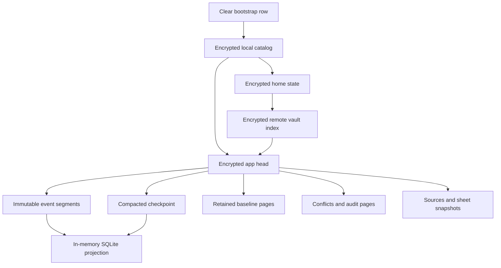
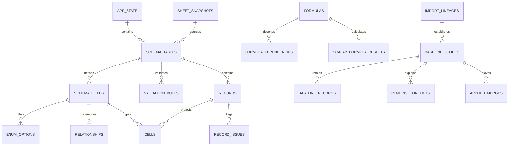

# Database Design — Sheaf

> **Phase:** database 
> **Status:** draft for builder approval 
> **Decision date:** 2026-09-08 
> **Inputs:** `./program/sheaf/specs/architecture.md` and
> `./program/sheaf/specs/requirements.md`

Sheaf has no server database. Its authoritative database is a deliberately
small **IndexedDB object graph of opaque encrypted envelopes**. A separate
**in-memory SQLite database** is rebuilt after unlock to answer relational
queries. A second, isolated IndexedDB database exists only for short-lived
encrypted inbound-share bytes on platforms that support PWA share targets.

This document fixes all persistent schemas, decoded payload contracts,
projection tables, indexes, transaction boundaries, retention rules, and
migration ownership for version 1. No later Forge session may own or edit the
migration paths listed in **Migration History**.

---

## Engine

| Purpose | Engine and version | Persistence | Authority |
|---|---|---|---|
| Main local store | IndexedDB through Dexie 4; database `sheaf-local`, schema version 1 | Durable browser-origin storage | **Authoritative** for all local state |
| Query projection | Official SQLite WASM with FTS5; schema/user version 1 | `:memory:` in the unlocked data worker only | Derived and disposable |
| Inbound share inbox | IndexedDB through Dexie 4; database `sheaf-share-inbox`, schema version 1 | Transient ciphertext with a 30-minute expiry | Transport only; never app state |
| Durable home | Provider-neutral immutable encrypted object graph, vault format 1 | Dropbox App Folder, OneDrive App Folder, or a user-saved bundle | Durable replica and reconciliation counterpart |

Dexie schema declarations list only primary keys and fields that are actually
queried, matching the library's [versioned store contract](https://dexie.org/docs/Version/Version.stores%28%29).
IndexedDB transactions supply the atomic local pointer swaps; transaction
completion and abort behavior follow the [IndexedDB 3.0 transaction model](https://www.w3.org/TR/IndexedDB-3/).
The projection uses an FTS5 contentless-delete table as defined by the
[SQLite FTS5 specification](https://www.sqlite.org/fts5.html). It does **not**
use SQLite's persistent OPFS modes; the official
[SQLite WASM persistence documentation](https://www.sqlite.org/wasm/doc/trunk/persistence.md)
is relevant only to explain that those modes are intentionally excluded.

### Why two database engines

- **IndexedDB** gives Sheaf atomic browser-native durable transactions without
  a custom encrypted filesystem. It holds ciphertext and operational headers
  only.
- **SQLite** gives the unlocked app relational joins, stable typed filtering,
  FTS5, aggregates, and strong projection constraints. It is never persisted,
  so a storage inspection cannot recover its plaintext tables.
- The same decoded events build SQLite and provider segments. SQLite is not a
  second source of truth, and a projection write is never proof of a save.

### Durability wording

An acknowledged local write means the IndexedDB transaction's `complete`
event has fired. The implementation requests strict durability where the
engine exposes it and configures Dexie's Chromium durability option as
`strict`; the option is a browser durability **hint**, not a claim against
physical media failure. Encryption, provider backup, and browser persistence
are separate properties and must remain separately described in the UI.

---

## Schema Overview

Only the bootstrap row and generic envelope headers are clear in the main
database. Every arrow after the bootstrap is an authenticated reference to a
random storage identifier. Object kind, app ownership, names, counts, event
types, provider labels, timestamps, and relationship structure are inside
ciphertext.

---

## Global Data Conventions

### Identifiers

| Identifier | Representation | Visibility | Rule |
|---|---|---|---|
| Domain IDs (`AppId`, `TableId`, `FieldId`, `RecordId`, `EventId`, and peers) | 16 CSPRNG bytes | Encrypted at rest; 16-byte SQLite `BLOB` while unlocked | Stable and immutable; never derived from a name or row position |
| Storage ID | 16 CSPRNG bytes; 22-character unpadded base64url in IndexedDB/provider names | Clear | Never equals or deterministically derives from a domain ID |
| Hash | SHA-256, 32 bytes | Clear only when authenticating opaque ciphertext; otherwise encrypted | Computed over the exact canonical bytes named by the field |
| Commit sequence | Unsigned 64-bit integer in canonical CBOR; safe positive JS integer for local transaction revisions | Encrypted except the local transaction revision and remote generation | Monotonic within its stated scope; never a wall-clock substitute |
| Timestamp | Signed 64-bit Unix epoch milliseconds | Encrypted except transient share-inbox expiry | Display evidence only; ordering is resolved with hybrid time and stable IDs |

All IDs are generated before their first committed use. Renames, re-upload,
adoption, compaction, theme edits, and provider changes preserve domain IDs.
SQLite rejects IDs whose byte length is not exactly 16.

### Canonical values

- Durable payloads use canonical CBOR: definite lengths, shortest integer
  encoding, sorted map keys, no duplicate keys, bounded depth, and no
  application object prototypes.
- Text values are Unicode NFC. The projection additionally computes an
  ephemeral versioned binary sort key; `TextSortKeyV1` is the UTF-8 encoding
  of that NFC text and compares bytewise. It is a deterministic code-point
  order, not an unstated browser locale collation. A later natural-sort policy
  increments the key version and rebuilds the disposable projection; the key
  is never durable.
- Numbers and currency are canonical finite decimal strings with at most 34
  significant digits. The projection stores a 20-byte order key described
  below; it never coerces these values to SQLite `REAL` for equality or sort.
- Dates are signed epoch-day integers in the projection. A date has no hidden
  time zone. `TODAY` and `NOW` use an injected clock and are not encoded in an
  event or checkpoint as calculated values.
- Enum cells store stable `OptionId` values; renaming an option does not
  rewrite every record. References store stable `RecordId` values.
- Missing, explicit blank, invalid preserved source value, unsupported-formula
  result, and `null` are distinct domain states in CBOR. A missing typed cell
  in SQLite is interpreted with the row's authored CBOR and issue rows; it is
  never silently converted to zero or an empty string.

### Decimal order key v1

To make exact decimal range filters and sorts indexable without a browser-
specific collation, every valid decimal has a fixed 20-byte big-endian key:

1. Normalize zero separately; otherwise remove leading and trailing zeroes
   from the coefficient and adjust the base-10 exponent.
2. Compute `adjustedExponent = exponent + coefficientDigits - 1`. The v1
   decimal domain is 34 significant digits with adjusted exponent from
   `-6143` through `+6144`; encode `adjustedExponent + 6143` as two unsigned
   big-endian bytes.
3. Right-pad the normalized coefficient to 34 decimal digits and pack two
   digits per byte into 17 bytes.
4. Prefix positive values with `0x02`; encode zero as `0x01` followed by
   nineteen zero bytes; prefix negative values with `0x00` and bitwise-invert
   the positive magnitude's exponent and coefficient bytes.

Binary lexicographic order then equals numeric order. Canonical decimal text
remains the value of record; the key is only a checked, rebuildable projection
index. Values outside the supported decimal domain remain in authored CBOR,
receive a type issue, and get no decimal cell.

### Version tuple

Version 1 is the tuple:

| Domain | Current version |
|---|---:|
| IndexedDB main schema | 1 |
| IndexedDB share-inbox schema | 1 |
| Canonical CBOR codec | 1 |
| Cipher suite | 1 |
| Envelope/frame | 1 |
| Domain event | 1 |
| SQLite projection | 1 |
| Vault/index/bundle | 1 |
| Padding profile | 1 |

Readers reject an unknown critical version before exposing data. A newer
database is never opened writable by an older build.

---

## Cleartext Budget

The clear local schema is intentionally incapable of answering product
questions while locked.

### Allowed in the main database

- Format and minimum-reader versions.
- Argon2id/HKDF algorithms, salts, and work parameters.
- Authenticated wrapped-root ciphertext and nonces.
- Random storage IDs and opaque parent pointers.
- Cipher/codec versions, logical revisions, and padded byte buckets.
- The monotonic database transaction revision and writer epoch.

### Forbidden in the main database

- App, table, field, record, event, chart, source, or account domain IDs.
- Object kind or owner on an envelope row.
- Names, row/event/app counts, last-opened or backup times, locality, reminder
  state, conflict presence, provider label, token expiry, or source filename.
- Search indexes, thumbnails, logs, crash text, or any plaintext projection.

The total number and padded sizes of generic envelope rows are observable to a
browser-storage inspector. Because events, checkpoints, source chunks,
snapshots, workflows, provider state, and cleanup tickets share the same store
and are variably batched, that observation is not a one-to-one app or record
inventory. The product makes no traffic-analysis claim beyond this bounded
leak.

The share inbox is a separate transport exception. It exposes random transfer
IDs, ordinal/chunk count, padded size, and expiry so the service worker can
finish and collect a handoff without any Sheaf key. Filename, MIME type, true
length, and source metadata stay inside its one-time-key ciphertext.

---

## Main IndexedDB — `sheaf-local`

The version-1 declaration is owned by
`./src/migrations/001_local_store_v1.ts`.

### Object stores

| Store | Primary key | Secondary indexes | Mutability |
|---|---|---|---|
| `bootstrap` | `slot` | None | One mutable singleton row |
| `envelopes` | `storageId` | `revision`; compound `[revision+storageId]` | Add-only until unreachable garbage is deleted |

There are deliberately only two stores. Separate stores for apps, records,
events, providers, or staging would leak their populations while locked and
would complicate atomic pointer promotion.

### `bootstrap`

| Property | Type | Constraints | Notes |
|---|---|---|---|
| `slot` | string | PK; exactly `root` | The only well-known key |
| `databaseFormatVersion` | integer | `1` | Dexie/local logical schema |
| `minimumReaderVersion` | integer | `1` | Downgrade fence |
| `codecVersion` | integer | `1` | Canonical CBOR baseline |
| `envelopeFormatVersion` | integer | `1` | Frame baseline |
| `cipherSuiteVersion` | integer | `1` | Argon2id/HKDF/XChaCha suite |
| `paddingProfileVersion` | integer | `1` | Bucket schedule |
| `transactionRevision` | safe integer | `>= 0`, monotonic | Increments once for every committed main-store write transaction |
| `writerEpoch` | safe integer | `>= 0`, monotonic | Invalidates older tabs when a format migration begins |
| `passphraseKdf` | object | Argon2id v1.3; salt `>= 16` bytes; at least 65,536 KiB, 3 iterations, 1 lane, 32-byte output | Calibrated upward but never below the architecture floor |
| `recoveryKdf` | object | HKDF-SHA-256; independent salt `>= 16` bytes; 32-byte output | Domain-separated local recovery derivation |
| `passphraseWrappedRoot` | object | Random wrap ID, 24-byte nonce, authenticated ciphertext | Wraps the same random 32-byte local root as the recovery wrapper |
| `recoveryWrappedRoot` | object | Same shape, different key and nonce | Lets the local recovery code unlock this device |
| `catalogStorageId` | storage ID | Required | Current encrypted `LocalCatalogV1` root |
| `migrationStorageId` | storage ID or null | Null unless a logical copy-on-write migration is resumable | Points to encrypted migration journal; never to user content directly |

**Constraints and access:**

- Creation uses `add`, so a second bootstrap row at `root` fails.
- Ordinary commits read the row, compare the caller's expected
  `transactionRevision` and `writerEpoch`, add all replacement envelopes,
  then update this row in the same `bootstrap + envelopes` transaction.
- `transactionRevision` must remain within `Number.MAX_SAFE_INTEGER`; reaching
  the guard band is a migration condition, not wraparound.
- Passphrase change updates only `passphraseKdf`, its wrapper, and the
  transaction revision. It never rewrites an app envelope.
- No failed-attempt counter is persisted in v1. Escalating unlock delay is
  session-memory defense in depth: persisting a useful pre-unlock counter
  would either exceed the cleartext budget or require a browser-held bypass
  key beside it. Argon2id remains the offline-attack boundary.

### `envelopes`

| Property | Type | Constraints | Notes |
|---|---|---|---|
| `storageId` | base64url string | PK; canonical 22 characters encoding 16 random bytes | Has no relation to a domain ID |
| `revision` | safe integer | Indexed; `>= 1`; no greater than current bootstrap revision | Transaction that first committed this immutable row |
| `envelopeFormatVersion` | integer | `1` | Clear decoder gate |
| `codecVersion` | integer | `1` | Clear decoder gate |
| `cipherSuiteVersion` | integer | `1` | Clear crypto gate |
| `paddedBytes` | integer | One v1 bucket; equals ciphertext byte length | Bounds allocation before read |
| `nonce` | bytes | Exactly 24 bytes; unique under its key | XChaCha20-Poly1305 nonce |
| `ciphertext` | bytes | Exact `paddedBytes`; at least one AEAD tag | Encrypted inner frame including true length and padding |

**Indexes:**

- **Primary `storageId`**: exact authenticated-pointer lookup.
- **`revision`**: scan rows introduced by a transaction during integrity,
  migration, and bounded garbage-collection work.
- **`[revision+storageId]`**: stable cursor pagination when multiple envelopes
  share one transaction revision.

No index exists on `paddedBytes`, nonce, ciphertext, or any semantic field.
Writers use `add`, never `put`, for envelopes. A duplicate random ID aborts the
whole transaction instead of mutating an existing object.

### Envelope plaintext and AAD

After successful AEAD authentication, the inner canonical CBOR value is:

| Field | Type | Rule |
|---|---|---|
| `innerVersion` | integer | Exactly `1` |
| `payloadKind` | closed string enum | Encrypted; must equal the authenticated parent's expected kind |
| `compression` | `none` or `deflate-raw-v1` | Compression happens before encryption using the pinned v1 codec |
| `encodedPayloadByteLength` | safe integer | Exact stored payload length; no greater than the authenticated inner-frame remainder |
| `decodedPayloadByteLength` | safe integer | Exact expected post-decompression length; checked against the closed scope budget before allocation |
| `payload` | bytes | Canonical CBOR or raw chunk bytes, decoded only after version/kind/size checks |

AEAD additional data is the canonical tuple
`["sheaf", scope, storageId, codecVersion, cipherSuiteVersion, logicalRevision]`.
The scope is **not** stored on the row. The bootstrap supplies the fixed
`local.catalog` scope; every other scope comes from a successfully decrypted
parent reference. A copied row therefore cannot be substituted across app,
vault, segment, ordinal, or purpose boundaries.

For provider and bundle transport, the same fields are serialized big-endian
behind the four-byte `SHF1` magic: envelope version, codec version, cipher
version, 16-byte storage ID, unsigned 64-bit logical revision, padded length,
24-byte nonce, and ciphertext. The authenticated parent additionally holds
the ciphertext SHA-256.

### Padding profile v1

Ciphertext, including its 16-byte tag, is padded inside encryption to the
smallest fitting bucket:

`4,096`, `16,384`, `65,536`, `262,144`, `1,114,112`, `4,259,840`, or
`16,777,216` bytes. The last bucket is exactly the architecture's 16 MiB
ciphertext ceiling; encoders stop adding events before frame/tag overhead
would overflow it.

No single decoded payload may exceed its parent's declared cap. Large sources
and snapshots use multiple independently authenticated chunks rather than a
larger row. Chunk ordinals and total count are encrypted and are also bound by
the parent manifest so omission, duplication, and reordering fail.

---

## Transient Share IndexedDB — `sheaf-share-inbox`

The version-1 declaration is owned by
`./src/migrations/002_share_inbox_v1.ts`. The service worker may
open this database; it must never open `sheaf-local`.

### `transfers`

| Property | Type | Constraints | Notes |
|---|---|---|---|
| `transferId` | storage ID string | PK; random | Shared with a same-origin client only |
| `formatVersion` | integer | `1` | Inbox format |
| `cipherSuiteVersion` | integer | `1` | One-time XChaCha stream suite |
| `createdAtMs` | integer | Nonnegative | Operational only |
| `expiresAtMs` | integer | Indexed; exactly creation + 30 minutes | Hard collection deadline |
| `chunkCount` | integer | `>= 1` | Completeness check |
| `paddedBytes` | integer | Sum of chunk buckets | Pre-claim allocation guard |
| `descriptorNonce` | bytes | 24 bytes | Encrypts filename/type/true length/stream descriptor |
| `descriptorCiphertext` | bytes | Authenticated | Uses one-time content key |
| `ciphertextDigest` | bytes | SHA-256, 32 bytes | Covers ordered descriptor and chunks |

**Index:** `expiresAtMs` supports bounded expiry collection.

### `chunks`

| Property | Type | Constraints | Notes |
|---|---|---|---|
| `transferId` | storage ID string | Compound PK part; indexed | Parent transfer |
| `ordinal` | integer | Compound PK part; contiguous from zero | Stream order |
| `expiresAtMs` | integer | Indexed; equals parent expiry | Allows orphan cleanup without a join |
| `paddedBytes` | integer | Approved bucket | Allocation cap |
| `nonce` | bytes | 24 bytes, unique under transfer key | Per-chunk AEAD |
| `ciphertext` | bytes | Exact padded length | Contains no clear file metadata |

**Indexes:** compound primary `[transferId+ordinal]` streams in order;
`transferId` deletes/claims one handoff; `expiresAtMs` collects stale orphan
chunks.

The one-time 32-byte content key exists only in the receiving service-worker
event and the same-origin client reached by `MessagePort`. Claim reads and
deletes all transfer rows atomically after digest/authentication. A missing
key, missing chunk, navigation loss, or expiry makes the bytes permanently
unreadable and eligible for immediate deletion. Inbox ciphertext is never
promoted directly: after local unlock, the data worker re-encrypts source
chunks under the provisional app key through ordinary import staging.

Descriptor AAD binds product/scope, transfer ID, expiry, and chunk count.
Chunk AAD additionally binds ordinal and padded length. The ordered digest
covers the exact descriptor ciphertext followed by every chunk frame, so rows
cannot be substituted between transfers or silently truncated.

---

## Encrypted Logical Collections

The following are **payload kinds**, not IndexedDB stores. They all occupy the
generic `envelopes` store and are found through authenticated references.

| Payload | Encryption key | Required contents | Retention |
|---|---|---|---|
| `LocalCatalogV1` | Local root | Device ID, local settings, app entries, home references, resumable workflow references, cleanup tickets, recovery-code view reference | Current catalog plus any old root still needed by an active verified migration |
| `HomeStateV1` | Local-root-derived home-state key | Home ID/kind, provider account boundary and label, OAuth tokens/expiry, wrapped vault key, vault header, known/confirmed heads, upload cursors, bundle staleness | Until home is disconnected and no app/history needs it |
| `WorkflowResumeV1` | Local root | Machine kind/state, opaque input references, cancellation and progress checkpoint; no record values | Until terminal receipt is committed |
| `CleanupTicketV1` | Local root | Random storage IDs to delete, reason enum, cursor, creation revision; never a destroyed provisional key | Until every listed row is absent |
| `MigrationJournalV1` | Local root | From/to tuple, source and replacement roots, verified hashes, phase and cursor | Until the new root is committed and old objects collected |
| `AppHeadV1` | App key | Current checkpoint, immutable event tail, baseline/conflict/audit/source/snapshot roots, frontier, schema revision, retained roots | Current head; predecessor retained only while referenced for rollback/compaction proof |
| `EventSegmentV1` | App key | One or more immutable event commits and resulting frontier | Append-only; compacted semantic history moves to checkpoint/audit, subject to retention rules |
| `CheckpointManifestV1` | App key | Schema/theme/chart/formula roots, sorted record-page refs, frontier and semantic hash | At least current verified checkpoint plus prior checkpoint until pointer swap |
| `RecordPageV1` | App key | Sorted live records with stable IDs, typed authored values, per-value provenance and issues | Current checkpoint; deleted restoration data remains in audit/event pages |
| `BaselinePageV1` | App key | Sorted `(scope, table, record)` baseline state/value/lineage | Indefinite while any import or device comparison can need it |
| `ConflictPageV1` | App key | Pending/resolved conflict evidence, full source versions, validation report, resolution event ref | Never removed before equivalent compacted audit exists; unresolved evidence is permanent until resolved |
| `AuditPageV1` | App key | Change summaries, automatic-merge proofs, deletion restoration payloads, provenance | Compacted but never silently discarded; record deletion payloads remain recoverable |
| `SourceManifestV1` / source chunks | App key | Original file identity, ordered encrypted source chunk refs and digest | Retained for fidelity and re-export while app exists |
| `SnapshotManifestV1` / snapshot chunks | App key | Safe normalized read-only sheet representation and inert-content anchors | Every imported sheet, for app lifetime |
| `ImportStageV1` | Provisional app key | Selected source facts, proposal, evidence ledger, review edits, negative decisions, temp object list | Until explicit promotion or verified cleanup |

### `LocalCatalogV1`

The catalog is the only semantic root the bootstrap can reach. Its canonical
fields are:

- `catalogVersion`, `catalogRevision`, and the random device `DeviceId`.
- Encrypted local settings: idle timeout, scratch-reminder interval policy,
  capacity calibration, recovery-code view reference, and last clean-lock
  state.
- `apps[]`, ordered by stable `AppId`. Each entry holds encrypted display
  metadata, locality, wrapped app key when local, current `AppHeadV1`
  reference when local, its optional single `HomeId`, row count/last-opened
  cache, confirmed backup facts, listed-only sizing metadata, and—while
  scratch—`ScratchReminderStateV1` with triggering commit ID, dismissal count,
  dismissed time, and next eligible reminder time.
- `homes[]`, each with a stable `HomeId`, kind, and `HomeStateV1` reference.
- Active workflow, migration, and cleanup references.

Catalog constraints are checked before encryption and again after decryption:

1. `AppId`, `HomeId`, and referenced storage IDs are unique.
2. `present` and `oversized-local` entries have a wrapped app key and app head.
3. `listed-only` entries have neither a local app key nor a local app head.
4. Scratch entries have no home. Non-scratch entries reference exactly one
   existing home. A bundle home is never considered enumerable.
5. Scratch reminder state is absent once a home is assigned; its timestamps
   and dismissal count never suppress the persistent scratch badge.
6. `VaultId` is unique among homes. For cloud homes,
   `(providerKind, stableProviderAccountId, vaultLocation)` is also unique, so
   one provider app folder cannot be mounted as two contradictory homes;
   provider account identity is part of every adapter lookup key.
7. Cached counts and times never authorize a destructive action; removal and
   reset recompute from the decrypted head/frontier before confirmation.

### `HomeStateV1`

Cloud-home state includes provider kind, stable provider account ID, account
label, narrow-scope token set and expiry, opaque provider vault location,
locally wrapped vault key, latest observed header/hash, latest confirmed
generation per app, confirmed frontiers, successful-backup times, and
resumable upload cursors. A provider token and an app key never share a worker
message. Bundle-home state contains only the last saved bundle generation,
hash, time, and stale flag; it contains no retained writable file handle.

`lastSuccessfulBackup` and confirmed frontier advance together only after the
provider acknowledges the conditional vault-head write. An upload cursor can
advance independently but is never a backup receipt.

### `AppHeadV1`

| Field | Rule |
|---|---|
| `appId` | Must match the catalog entry and every referenced payload |
| `headRevision` | Monotonic app-local logical revision |
| `schemaRevision` | Revision required by every new event and checkpoint |
| `checkpoint` | Exactly one verified checkpoint manifest |
| `eventSegments` | Ordered authenticated refs covering commits strictly after the checkpoint frontier |
| `frontier` | Maximum contiguous commit sequence per device after replay |
| `baselinePages` | Complete roots for every active import/durable-home scope, including explicit absent entries |
| `conflictPages` | All pending conflicts and retained resolution evidence |
| `auditPages` | Change history and automatic-merge evidence retained after compaction |
| `sourceManifests` | Every accepted original import/re-upload source still belonging to the app |
| `snapshotManifests` | Exactly one reachable safe snapshot per imported sheet version required by the UI |
| `retainedRoots` | Old generations required by a baseline, deletion restoration, rollback proof, migration, or in-flight backup |
| `semanticSha256` | Hash of the canonical decoded state represented by checkpoint plus tail |

The device-only change count is the count of distinct local **commit IDs** not
covered by the app's confirmed durable-home frontier. One user command is one
commit even when it contains multiple events. Imported and reconciliation
commits also count when their resulting state has not yet reached the confirmed
home; calculated formula updates and last-opened metadata do not.

### Checkpoint and page boundaries

- A `RecordPageV1` contains at most 1,024 live records or 512 KiB decoded CBOR,
  whichever comes first. Records are sorted by `(TableId, RecordId)`.
- Baseline, conflict, and audit pages use the same 512 KiB decoded cap and
  stable key order.
- A checkpoint manifest records each page's first/last logical key, decoded
  count, decoded-byte cap, semantic SHA-256, and encrypted envelope reference.
- A source or normalized snapshot chunk carries at most 1 MiB decoded bytes.
- No page count is used as a user-facing exact row count until all pages have
  authenticated and their manifest totals agree.
- A checkpoint never contains calculated `TODAY`/`NOW` values. Deterministic
  computed values are recomputed; imported frozen values are authored literals
  with provenance; unsupported imported cached values remain explicit source
  values.

---

## Append-Only Event Format

The baseline event contract is owned by
`./src/migrations/004_event_format_v1.ts`. Events are logical facts inside
encrypted `EventSegmentV1` envelopes; they are not IndexedDB rows.

### Atomic commit envelope

One accepted command, import promotion, conflict decision, or automatic merge
creates one `EventCommitV1`:

| Field | Type | Constraint and purpose |
|---|---|---|
| `eventFormatVersion` | integer | Exactly `1` |
| `commitId` | 16-byte ID | Globally unique; unit counted for device-only changes |
| `appId` | 16-byte ID | Same for every event and segment containing the commit |
| `deviceId` | 16-byte ID | Authoring/reconciling device; encrypted everywhere |
| `deviceCommitSequence` | uint64 | Exactly previous contiguous device sequence + 1 |
| `previousDeviceCommitSha256` | hash or null | Per-device append-chain predecessor; null only at sequence 1 |
| `basisFrontier` | sorted `(DeviceId, sequence)` pairs | State observed before authoring; no duplicate devices or negative sequence |
| `hybridTime` | wall milliseconds + logical counter | Display ordering and deterministic tie break; never conflict authority by itself |
| `eventClass` | enum | `authored`, `import`, `reconciliation`, or `system` |
| `schemaRevisionBefore` | uint64 | Must equal the projection revision at validation |
| `schemaRevisionAfter` | uint64 | Same as before unless this atomic commit changes schema |
| `events` | nonempty event array | Event indexes contiguous from zero; all subjects belong to this app |
| `commitSha256` | hash | SHA-256 of the canonical commit body with this field omitted |

Within a segment, commits use canonical order
`(hybrid wall time, logical counter, device ID, device sequence, commit ID)`
for replay presentation. **Causality comes from frontier and per-device
sequence**, not wall-clock order. The reconciler compares event sets/frontiers
and explicit baselines; it never implements last-write-wins.

`EventSegmentV1` contains a random segment ID, app ID, one or more complete
commits, the resulting frontier, and a semantic hash. A segment may contain no
more than 10,000 events or 16 MiB padded ciphertext. A commit is never split
between segments. Immutable segments may be repacked during verified
compaction, but their event/commit IDs and semantic hashes do not change.

### Event catalog and payload constraints

| Kind | Required payload | Replay/retention rule |
|---|---|---|
| `app.created` | Initial app name, stable table/field/chart/theme IDs, accepted import lineage, initial schema | First semantic event only; pairs with an initial checkpoint |
| `app.renamed` | Prior name hash, new name | App ID remains fixed |
| `table.created` | Complete new table definition and source provenance | New random table ID |
| `table.changed` | Before hash, changed definition fields, impact analysis, preserved-value disposition | Rename/type-impact edits never discard values |
| `field.created` | Complete field definition and evidence | New random field ID |
| `field.changed` | Before/after definition, impact analysis, preservation/issue plan | Field ID and owning table remain fixed |
| `enum.changed` | Field ID, prior option-set hash, complete stable-ID option set | Removed/renamed options remain interpretable in history |
| `relationship.changed` | Complete endpoints, direction labels, detection source, prior hash if replacing | Reference/key changes require full validation |
| `relationship.removed` | Complete former definition and optional rejection-evidence fingerprint | A review rejection prevents silent re-detection |
| `rule.changed` | Complete record-rule IR, message parameters, prior hash if replacing | Same IR is used for CRUD and merge validation |
| `rule.removed` | Complete former rule and impact report | Existing values are preserved and re-evaluated |
| `formula.changed` | Original text, versioned IR/disposition, dependencies, target, prior hash | Never includes a current `TODAY`/`NOW` result |
| `formula.removed` | Complete former definition and impact report | Authored literals remain; no result is silently materialized |
| `record.created` | Complete authored field map plus per-value provenance | Shared validator must have passed unless explicitly imported-invalid and flagged |
| `record.patched` | Record revision, sparse field changes containing before and after values, resulting record hash | One delta; unchanged values are not duplicated |
| `record.deleted` | Prior record revision, complete restoration payload, deletion reason/source | Never purged in v1; drives recoverable delete history |
| `record.restored` | Deleted-event ID and complete restored record | Shared validator must pass before commit |
| `chart.saved` | Complete stable-ID chart definition, prior hash if updating, pin state | Includes imported and user charts |
| `chart.deleted` | Complete prior chart definition | Audit retained |
| `theme.changed` | Before/after semantic theme definition | App-specific and syncable |
| `inference-decision.recorded` | Evidence fingerprint, statement/evidence, accepted/rejected/edited disposition | Negative relationship decisions persist across re-import |
| `import.accepted` | Lineage ID, source/snapshot refs, evidence ledger, accepted schema/checkpoint and original baseline refs | Initial import only; promotion boundary |
| `reupload.accepted` | Prior/new lineage, identity decisions, absence review, reconciliation plan, new import baseline refs | File absence never emits delete implicitly |
| `durable-home.assigned` | Home ID/kind, vault ID, wrapped-app-key version | Only scratch-to-home in v1; provider secrets remain in local home state |
| `conflict.detected` | Conflict ID/kind, baseline or explicit absence, complete local/incoming source versions, timestamps, validation report | Local record stays active; evidence retained |
| `conflict.resolved` | Conflict ID, explicit decision mode, resulting valid record/schema, source evidence | Only event allowed to mark a pending conflict resolved |
| `merge.applied` | Baseline ref, both source refs/versions, composed result, successful validation report and explanation | Powers the visible applied log |
| `app.deletion-marked` | Permanent marker ID, provider generation receipt, final frontier/hash and deletion time | Written only after the remote marker head is confirmed; copied into deletion evidence |

The list is closed for event format 1. A new event kind requires a forward
event-format migration rather than an unversioned string.

### Events that do not exist

- Recalculation events: deterministic and clock-volatile values are derived.
- Automatic deletion for a row missing from a re-upload.
- Last-opened, reminder-dismissed, OAuth-refresh, upload-progress, or query
  events. These are encrypted local operational state, not authored history.
- Last-write-wins or conflict-timeout events.
- Physical compaction events presented as user changes. Compaction may add a
  system audit proof but cannot change semantic state.

### Replay guards

Before applying a commit, replay verifies frame AEAD/hash, segment app ID,
commit hash, event IDs/indexes, per-device hash-chain continuity, frontier
monotonicity, schema-before revision, stable subject ownership, and payload
schema. Domain validation then checks semantic constraints. A failure leaves
the previous projection/head intact and surfaces a recoverable corruption
state; it never skips a bad event and continues.

---

## Baselines, Conflicts, and Audit

### Baseline identity

A baseline key is `(BaselineScopeId, TableId, RecordId)`.

- **Import scope:** names one accepted `ImportLineageId`. Its value is the row
  as accepted from the previous import of that workbook into this app.
- **Durable-home scope:** names one `HomeId` and one counterpart/device ID, plus
  the remote generation/frontier at which agreement was confirmed.
- **Present:** complete agreed authored record.
- **Deleted:** both sides agreed the record was absent.
- **Absent:** no trustworthy agreed value exists, with a reason such as
  `never-shared`, `legacy-without-baseline`, or `proof-unavailable`.

There is an explicit entry for every row participating in a comparison.
Absence of a page/entry is corruption, not `baseline-absent`. Pages are sorted
and keyed so a baseline lookup never guesses from the current record.

### Conflict record

A `ConflictPageV1` item contains conflict ID, table/record ID, kind, scope,
baseline state/value, complete local and incoming versions, conflicting field
IDs, both source labels and timestamps, any failed validation report,
detection event, status, and optional resolution event. The original evidence
is immutable. Resolution appends a new event and changes only the current
index/status projection.

Identity and schema conflicts may use an object ID instead of a current
`RecordId`, but still retain complete alternatives. A record-level validation
conflict always stores the two whole source records and the exact report that
rejected their composition.

### Applied merge proof

Every automatic merge retains:

- baseline scope/value and proof frontier;
- local and incoming commit/source references;
- changed-field sets for both sides;
- complete composed result;
- the successful shared `ValidationReport` and schema revision;
- generated result commit ID and human-readable explanation parameters.

This proof moves into `AuditPageV1` during compaction and remains queryable by
record and time. It cannot be replaced by a log string or echoed request.

### Retention floor

Compaction and garbage collection must retain:

1. Every current checkpoint/head and its event tail.
2. Every baseline still named by an import lineage, known device receipt,
   pending conflict, applied proof, or retained generation.
3. Every pending conflict and both source versions.
4. Every applied-merge proof required by the visible applied log.
5. Every record-delete restoration payload, because v1 has no permanent
   record-purge surface.
6. Every original source and sheet snapshot promised by the import contract.
7. Every permanent durable-home deletion marker.
8. Every object referenced by an in-flight migration, backup, adoption,
   export cursor, or cleanup proof.

There is no time-based baseline, delete-event, or deletion-marker expiry in
version 1.

---

## Import and Adoption Staging

### Import staging

At pre-flight acceptance, the data worker generates a random provisional app
key and an `ImportStageId`. That provisional key **becomes the app key on
promotion**; large retained source/snapshot bytes therefore need no
re-encryption at the review boundary.

`ImportStageV1` contains:

- detected source format and contradiction notice, source digest, safe
  metadata inventory, selected sheets, and capacity estimate;
- ordered source and normalized-fact chunk references;
- proposed tables/fields/rules/formulas/charts/relationships;
- one evidence statement for every inference and every sheet;
- review edits and explicit negative decisions;
- all provisional storage IDs, split into retained-on-promotion and temporary;
- parser cursor/progress and terminal status.

The wrapped provisional key is reachable only through the encrypted workflow
root in the current local catalog. No app catalog entry exists yet.

**Cancellation/refusal/failure order:**

1. In one main-store transaction, replace the catalog without the workflow
   reference, delete the old workflow/key-wrap envelope, add an encrypted
   cleanup ticket containing only storage IDs, and advance the bootstrap.
2. The now-unreachable provisional key makes the staged bytes
   cryptographically inaccessible immediately.
3. Delete ticketed opaque rows in bounded transactions, persisting cursor
   progress without ever restoring the key.
4. Delete the ticket and return the cleanup receipt only after every row is
   absent. The shell never had a partial app to display.

**Promotion order:**

1. Validate the complete reviewed proposal with the shared validator and
   allocate permanent domain IDs.
2. Build initial record/checkpoint/baseline/snapshot roots and event commit
   outside the write transaction, all under the provisional/final app key.
3. In one transaction, add the immutable roots, wrap the app key under the
   local root, add the new local app entry/head, remove the staging workflow,
   ticket temporary inference chunks for cleanup, replace the catalog, and
   advance bootstrap.
4. Acknowledge `Create app` only after transaction completion; project from
   the committed checkpoint/event.

### Adoption staging

Discovery adds only an encrypted **listed-only** catalog entry containing
vault-index metadata. It has no app key or head. Adoption then:

1. Authenticates the selected vault entry and checks declared padded bytes
   plus migration/temporary headroom before downloading an app object.
2. Downloads immutable ciphertext to generic envelope rows that are not yet
   referenced by the catalog.
3. Authenticates every frame/hash, unwraps the app key, runs required logical
   migrations, replays all events, and validates the resulting app.
4. In one transaction, wraps the app key locally, changes the entry from
   listed-only to present, installs its app head, replaces the catalog, and
   advances bootstrap.
5. On any failure, retains listed-only state, destroys the uncommitted local
   key wrap, and collects downloaded rows through a cleanup ticket.

Adoption never creates an import lineage, inference decision, review state,
or second import baseline.

---

## In-Memory SQLite Projection

The executable DDL is owned by
`./src/migrations/005_projection_v1.sql`. The database opens as `:memory:` in
the data worker, enables foreign keys, applies the migration, hydrates one
entered app, and is closed by terminating the worker on lock. Listed-only apps
never receive a projection. Oversized-local apps use a bounded sequential
export cursor rather than this interactive projection.

The projection is a normalized typed-cell model rather than dynamically named
SQL columns. Stable IDs remain values, schema editing needs no SQL identifier
migration, and every user query is compiled from closed prepared-statement
templates. There is no user SQL surface.

### Projection relationship overview

SQLite-managed `record_search_*` shadow tables belong exclusively to FTS5.
Application code never reads or writes a shadow table directly.

### `projection_meta`

| Column | Type | Constraints | Notes |
|---|---|---|---|
| `singleton` | INTEGER | PK; exactly `1` | One app projection per SQLite database |
| `projection_format_version` | INTEGER | `NOT NULL`; exactly `1` | DDL gate |
| `event_format_version` | INTEGER | `NOT NULL`; exactly `1` | Replay gate |
| `app_id` | BLOB | `NOT NULL`; 16 bytes | Hydrated app |
| `checkpoint_storage_id` | BLOB | Null or 16 bytes; paired with checkpoint hash | Encrypted checkpoint source |
| `checkpoint_semantic_sha256` | BLOB | Null or 32 bytes; paired with checkpoint ID | Replay-equivalence anchor |
| `frontier_cbor` | BLOB | `NOT NULL`; nonempty | Applied device frontier |
| `text_sort_key_version` | INTEGER | Positive | Rebuilds text keys when comparison changes |
| `decimal_order_key_version` | INTEGER | Exactly `1` | Decimal-key gate |
| `hydrated_at_ms` | INTEGER | Nonnegative | Session diagnostic; never persisted |

The app ID is immutable. `app_state` insert/update triggers require the same
app ID before any query result can be served.

### `app_state`

| Column | Type | Constraints | Notes |
|---|---|---|---|
| `singleton` | INTEGER | PK; exactly `1` | One row |
| `app_id` | BLOB | Unique; 16 bytes | Stable app identity |
| `display_name` | TEXT | Nonempty | Decrypted app name |
| `created_at_ms` | INTEGER | Nonnegative | Authored creation time |
| `last_opened_at_ms` | INTEGER | Nullable, nonnegative | Encrypted catalog projection |
| `schema_revision` | INTEGER | Nonnegative | Active schema |
| `locality` | TEXT | `present` or `oversized-local` | Listed-only apps cannot open this projection |
| `durable_home_id` | BLOB | Null or 16 bytes | Null means scratch |
| `last_successful_backup_ms` | INTEGER | Nullable, nonnegative | Confirmed receipt only |
| `device_only_change_count` | INTEGER | Nonnegative | Distinct unconfirmed commit IDs |
| `theme_cbor` | BLOB | Nonempty | Semantic app theme |
| `state_revision` | INTEGER | Nonnegative | Stale-view guard |

### `sheet_snapshots`

| Column | Type | Constraints | Notes |
|---|---|---|---|
| `sheet_id` | BLOB | PK; 16 bytes | Stable imported sheet ID |
| `display_name` | TEXT | Nonempty | Original sheet label |
| `sheet_ordinal` | INTEGER | Unique; nonnegative | Workbook order |
| `classification_cbor` | BLOB | Nonempty | One or more table/lookup/summary/chart/snapshot roles |
| `snapshot_manifest_storage_id` | BLOB | 16 bytes | Encrypted safe snapshot root |
| `declared_row_count` | INTEGER | Nullable, nonnegative | Omitted when unknown rather than shown as zero |
| `declared_column_count` | INTEGER | Nullable, nonnegative | Same truthfulness rule |
| `snapshot_revision` | INTEGER | Nonnegative | Source/snapshot generation |

### `schema_tables`

| Column | Type | Constraints | Notes |
|---|---|---|---|
| `table_id` | BLOB | PK; 16 bytes; immutable trigger | Stable table ID |
| `display_name` | TEXT | Nonempty | User-editable label |
| `table_ordinal` | INTEGER | Unique; nonnegative | Navigation order |
| `source_sheet_id` | BLOB | Nullable FK to `sheet_snapshots`; `ON DELETE SET NULL` | Provenance |
| `key_field_id` | BLOB | Nullable deferred FK to `schema_fields`; restricted delete | Active authored identity field; ownership trigger requires the same table |
| `label_field_id` | BLOB | Nullable deferred FK to `schema_fields`; restricted delete | Active human reference label; ownership trigger requires the same table |
| `is_active` | INTEGER | Boolean check | Inactive definitions remain interpretable in history |
| `schema_revision` | INTEGER | Nonnegative | Definition revision |

### `schema_fields`

| Column | Type | Constraints | Notes |
|---|---|---|---|
| `field_id` | BLOB | PK; 16 bytes; immutable trigger | Stable field ID |
| `table_id` | BLOB | FK to `schema_tables`; immutable; `ON DELETE RESTRICT` | Owning table |
| `display_name` | TEXT | Nonempty | User-editable label |
| `field_ordinal` | INTEGER | Unique with table; nonnegative | Form/table order |
| `logical_type` | TEXT | Closed 11-type check | Date, currency, number, phone, email, URL, address, boolean, enum, text, reference |
| `storage_kind` | TEXT | Closed check and type mapping | `text`, `decimal`, `integer`, or `id` |
| `is_required` | INTEGER | Boolean check | Column validation |
| `is_computed` | INTEGER | Boolean check | Controls cell origin |
| `is_active` | INTEGER | Boolean check | Preserves old values/history |
| `formula_id` | BLOB | Required exactly when computed; deferred FK to `formulas`; restricted delete | Formula target |
| `source_evidence_cbor` | BLOB | Nullable, nonempty | Declared/inferred evidence |
| `schema_revision` | INTEGER | Nonnegative | Definition revision |

The deferred references allow tables/fields/formulas to load as one
transaction despite their intentional cycle; they must all resolve by commit.
Triggers prevent a referenced key/label field from moving tables or becoming
inactive, and prevent a key from becoming computed. Key-value uniqueness and
schema-impact behavior remain shared-validator rules because the typed lane is
generic rather than a per-field SQL column.
The row `CHECK` maps currency/number to decimal, date/boolean to integer,
enum/reference to ID, and the remaining textual types to text. Type-invalid
source values stay in `records.authored_cbor` and appear in `record_issues`;
the typed index lane remains absent.

### `enum_options`

| Column | Type | Constraints | Notes |
|---|---|---|---|
| `option_id` | BLOB | PK; 16 bytes | Stable across label edits |
| `field_id` | BLOB | FK to `schema_fields`; restricted delete | Owning enum field |
| `display_label` | TEXT | Nonempty | User-facing value |
| `option_ordinal` | INTEGER | Unique with field; nonnegative | Picker order |
| `is_active` | INTEGER | Boolean check | Retains removed imported values |
| `source_value_cbor` | BLOB | Nullable, nonempty | Original workbook representation |
| `schema_revision` | INTEGER | Nonnegative | Definition revision |

Insert/update triggers reject an option whose field is not logically `enum`.

### `relationships`

| Column | Type | Constraints | Notes |
|---|---|---|---|
| `relationship_id` | BLOB | PK; 16 bytes | Stable relationship identity |
| `from_table_id` | BLOB | FK to `schema_tables` | Child table |
| `from_field_id` | BLOB | Unique FK to `schema_fields` | Reference field |
| `to_table_id` | BLOB | FK to `schema_tables` | Parent table |
| `to_key_field_id` | BLOB | FK to `schema_fields` | Parent key field |
| `detection_source` | TEXT | `declared`, `lookup-formula`, `key-match`, or `user` | Review evidence |
| `is_active` | INTEGER | Boolean check | Disabled relationships remain auditable |
| `schema_revision` | INTEGER | Nonnegative | Definition revision |

Insert/update triggers prove that the source field belongs to the source
table, is a reference, the target field belongs to the target table, and the
target table names it as its key. Record-level referential validity remains in
the shared validator so imported broken references can be preserved and
flagged instead of refused by a SQL FK.

**Index:** `idx_relationships_parent` on
`(to_table_id, to_key_field_id, is_active)` finds reverse navigation metadata.

### `validation_rules`

| Column | Type | Constraints | Notes |
|---|---|---|---|
| `rule_id` | BLOB | PK; 16 bytes | Stable record-rule ID |
| `table_id` | BLOB | FK to `schema_tables` | Validated table |
| `display_name` | TEXT | Nonempty | User-facing rule name |
| `rule_ir_cbor` | BLOB | Nonempty | Closed versioned cross-field rule IR |
| `message_key` | TEXT | Nonempty | Localized message selector, not interpolated SQL |
| `message_parameters_cbor` | BLOB | Nonempty | Safe user-language parameters |
| `is_active` | INTEGER | Boolean check | Editable rule lifecycle |
| `schema_revision` | INTEGER | Nonnegative | Compatibility gate |

**Index:** `idx_validation_rules_table_active` on `(table_id, is_active)` loads
all rules for a write or merge.

### `formulas`

| Column | Type | Constraints | Notes |
|---|---|---|---|
| `formula_id` | BLOB | PK; 16 bytes | Stable formula ID |
| `target_kind` | TEXT | Computed column, table metric, or dashboard value | Closed target set |
| `table_id` | BLOB | Nullable FK | Required for column/metric target |
| `target_field_id` | BLOB | Nullable FK | Required only for computed column |
| `display_name` | TEXT | Nullable, nonempty | Metric/dashboard label |
| `original_text` | TEXT | Nonempty | Source/editable expression |
| `formula_ir_cbor` | BLOB | Nullable, nonempty | Null only where unsupported parsing cannot produce safe IR |
| `disposition` | TEXT | `live`, `frozen`, or `unsupported` | Fidelity policy |
| `determinism` | TEXT | Closed four-state check | Deterministic, clock-volatile, frozen-nondeterministic, unsupported |
| `metadata_cbor` | BLOB | Nonempty | Function versions, source and imported-value policy |
| `is_active` | INTEGER | Boolean check | Editable lifecycle |
| `schema_revision` | INTEGER | Nonnegative | Dependency compatibility |

Target/disposition combinations are protected by `CHECK`; triggers ensure a
computed-column formula and its computed field point at each other. Live and
frozen formulas require an IR; only an unsupported formula may lack one.

**Index:** `idx_formulas_table_target` on
`(table_id, target_kind, is_active)` loads table formulas and metrics.

### `formula_dependencies`

| Column | Type | Constraints | Notes |
|---|---|---|---|
| `formula_id` | BLOB | Composite PK; FK to `formulas`; cascade delete | Dependent node |
| `dependency_kind` | TEXT | Composite PK; field or formula | Edge type |
| `dependency_id` | BLOB | Composite PK; 16 bytes; target-existence trigger | Referenced field or formula node |

**Index:** `idx_formula_dependencies_dependency` on
`(dependency_kind, dependency_id, formula_id)` performs downstream
invalidation. Cycles are retained as issues, not executed.
Insert/update triggers require the polymorphic target to exist in the table
named by `dependency_kind`; cycle eligibility remains a domain-graph decision.

### `scalar_formula_results`

| Column | Type | Constraints | Notes |
|---|---|---|---|
| `formula_id` | BLOB | PK/FK to `formulas`; cascade delete | Metric/dashboard formula |
| `status` | TEXT | `ok`, `empty`, `unsupported`, `cycle`, or `error` | Truthful result state |
| `value_cbor` | BLOB | Required for `ok`; otherwise optional | Ephemeral typed value |
| `evaluated_at_ms` | INTEGER | Nonnegative | Session clock used for result |

This table disappears on lock. Its clock-volatile values never enter an event,
checkpoint, envelope, provider object, or export unless freshly recalculated
as part of the user-directed export.

### `records`

| Column | Type | Constraints | Notes |
|---|---|---|---|
| `record_pk` | INTEGER | Rowid PK | Ephemeral compact join/FTS key |
| `record_id` | BLOB | Unique; 16 bytes; immutable | Durable record identity |
| `table_id` | BLOB | FK to `schema_tables`; immutable | Owning table |
| `record_revision` | INTEGER | Nonnegative | Optimistic command guard |
| `created_commit_id` | BLOB | 16 bytes | Provenance |
| `updated_commit_id` | BLOB | 16 bytes | Current authored revision |
| `authored_cbor` | BLOB | Nonempty | Complete authored values, invalid preserved values, and per-value provenance |

Only live records appear. A delete removes its projection row and cascades
typed cells/issues, while the durable delete event retains the complete
restoration payload. Initial hydration assigns `record_pk` in binary
`(TableId, RecordId)` order; later creates receive the next rowid. It is a
session cursor only, so projection rebuild invalidates outstanding page
cursors rather than pretending that rowid is a durable user order.

**Index:** `idx_records_table_row` on `(table_id, record_pk)` paginates a
table and supports exact counts. The unique `record_id` index performs direct
record and relationship-target lookup.

### `cells`

| Column | Type | Constraints | Notes |
|---|---|---|---|
| `record_pk` | INTEGER | Composite PK; FK to `records`; cascade delete | Owning live record |
| `field_id` | BLOB | Composite PK; FK to `schema_fields` | Stable field |
| `origin` | TEXT | `authored` or `computed` | Prevents calculated facts becoming authored facts |
| `value_kind` | TEXT | `text`, `decimal`, `integer`, or `id` | Exactly one typed lane |
| `text_value` | TEXT | Text lane only | Display value |
| `text_sort_key` | BLOB | Text lane only | Versioned ephemeral sort key |
| `decimal_value` | TEXT | Decimal lane only | Canonical exact value |
| `decimal_order_key` | BLOB | Decimal lane only; exactly 20 bytes | Exact indexed order |
| `integer_value` | INTEGER | Integer lane only | Epoch-day date or boolean |
| `id_value` | BLOB | ID lane only; 16 bytes | Enum option or referenced record |

The row `CHECK` requires exactly one lane. Insert/update triggers also prove
that field and record belong to the same table, `value_kind` matches the field
storage kind, authored/computed origin matches the field definition, and a
boolean integer is `0` or `1`.

**Indexes:**

- `idx_cells_field_text` on `(field_id, text_sort_key, record_pk)` for text
  sort/range; partial to text rows.
- `idx_cells_field_decimal` on
  `(field_id, decimal_order_key, record_pk)` for exact numeric sort/range;
  partial to decimal rows.
- `idx_cells_field_integer` on `(field_id, integer_value, record_pk)` for
  date/boolean filter/sort; partial to integer rows.
- `idx_cells_field_id` on `(field_id, id_value, record_pk)` for enum filters,
  parent lookup, and reverse relationships; partial to ID rows.

A null/missing or invalid value has no typed-cell row. Its authoritative state
remains in `records.authored_cbor`, with a corresponding issue when invalid.

### `record_issues`

| Column | Type | Constraints | Notes |
|---|---|---|---|
| `issue_id` | BLOB | PK; 16 bytes | Stable derived issue identity for the current replay |
| `record_pk` | INTEGER | FK to `records`; cascade delete | Flagged record |
| `field_id` | BLOB | Nullable FK | Null for whole-record issue |
| `rule_id` | BLOB | Nullable FK | Record-rule source where applicable |
| `issue_kind` | TEXT | Closed type/required/enum/reference/rule/formula/schema/conflict/unsupported set | Machine-readable class |
| `severity` | TEXT | Warning or blocking | UI/action policy |
| `message_key` | TEXT | Nonempty | Plain-language message selector |
| `message_parameters_cbor` | BLOB | Nonempty | Safe structured details |
| `provenance_cbor` | BLOB | Nullable, nonempty | Imported value/source evidence |

**Index:** `idx_record_issues_record` on
`(record_pk, severity, issue_kind)` supplies card/table flags and validation
summaries. Insert/update triggers require any named field or record rule to
belong to the issue record's table.

### `record_search`

| Column | Type | Constraints | Notes |
|---|---|---|---|
| implicit `rowid` | INTEGER | Equals `records.record_pk` | Join key |
| `searchable_text` | FTS5 text | Contentless-delete; Unicode61; diacritics removed; 2/3-character prefix indexes | Concatenated searchable display text only |

The worker supplies all searchable authored text, enum labels, and reference
labels in schema ordinal order. It excludes hidden provenance, deleted values,
unsupported markup, and formulas. Every record mutation updates `records`,
`cells`, issues, and FTS in the same SQLite transaction. Since the projection
is disposable, any detected FTS mismatch closes and rebuilds it rather than
repairing shadow tables.

### `charts`

| Column | Type | Constraints | Notes |
|---|---|---|---|
| `chart_id` | BLOB | PK; 16 bytes | Stable chart identity |
| `display_name` | TEXT | Nonempty | User-facing name |
| `chart_type` | TEXT | Bar, line, pie, scatter, or stacked | Approved types only |
| `definition_cbor` | BLOB | Nonempty | Stable table/field/relationship IDs, aggregation, filters and series |
| `is_pinned` | INTEGER | Boolean check | App-home placement |
| `chart_ordinal` | INTEGER | Unique; nonnegative | Display order |
| `provenance` | TEXT | Imported or user | Review/history label |
| `chart_revision` | INTEGER | Nonnegative | Stale-builder guard |

Chart result datasets are request-scoped worker values, not rows. They always
carry source/omitted scope alongside the marks.

**Index:** `idx_charts_pinned_ordinal` on `(is_pinned, chart_ordinal)` builds
the pinned dashboard without scanning unpinned definitions. The unique
`chart_ordinal` constraint orders the complete chart list.

### `inert_content`

| Column | Type | Constraints | Notes |
|---|---|---|---|
| `inert_item_id` | BLOB | PK; 16 bytes | Stable item |
| `sheet_id` | BLOB | FK to `sheet_snapshots`; restricted delete | Owning sheet |
| `item_kind` | TEXT | Nonempty | Drawing, external link, unsupported formula/object, and peers |
| `source_location` | TEXT | Nonempty | User-understandable sheet/range/part location |
| `reason_key` | TEXT | Nonempty | Why it is not interactive |
| `snapshot_anchor_cbor` | BLOB | Nullable | Safe navigation anchor |
| `preserved_manifest_storage_id` | BLOB | Null or 16 bytes | Original encrypted object root when separately preserved |

**Index:** `idx_inert_content_sheet` on `(sheet_id, item_kind)` powers sheet
counts and the visible inert-content list.

### `import_lineages`

| Column | Type | Constraints | Notes |
|---|---|---|---|
| `lineage_id` | BLOB | PK; 16 bytes | Stable import/re-upload lineage |
| `import_kind` | TEXT | Initial or re-upload | Workflow source |
| `import_ordinal` | INTEGER | Unique; nonnegative | Sequence in this app |
| `source_display_name` | TEXT | Nonempty | Decrypted filename for user-facing evidence |
| `source_sha256` | BLOB | Exactly 32 bytes | Exact original source fingerprint |
| `accepted_at_ms` | INTEGER | Nonnegative | Explicit acceptance time |
| `identity_decisions_cbor` | BLOB | Nonempty | Key/match/new-table/ambiguous decisions |
| `accepted_commit_id` | BLOB | 16 bytes | Event proof |

### `inference_decisions`

| Column | Type | Constraints | Notes |
|---|---|---|---|
| `decision_id` | BLOB | PK; 16 bytes | Stable review decision |
| `decision_kind` | TEXT | Closed header/discard/split/merge/type/enum/relationship/formula/classification/rule set | Review category |
| `evidence_fingerprint_sha256` | BLOB | 32 bytes; unique with kind | Re-detection suppression key |
| `disposition` | TEXT | Accepted, rejected, or edited | User decision, not app lifecycle |
| `statement_cbor` | BLOB | Nonempty | Plain-language inference statement |
| `evidence_cbor` | BLOB | Nonempty | Declared/inferred proof |
| `recorded_event_id` | BLOB | 16 bytes | Append-only authority |

The unique `(decision_kind, evidence_fingerprint_sha256)` constraint makes a
rejected relationship or equivalent proposal discoverable before inference
can silently propose it again.

### `baseline_scopes`

| Column | Type | Constraints | Notes |
|---|---|---|---|
| `baseline_scope_id` | BLOB | PK; 16 bytes | Comparison lineage |
| `scope_kind` | TEXT | Import or durable-home | Closed scope |
| `import_lineage_id` | BLOB | Nullable FK to `import_lineages` | Required only for import |
| `durable_home_id` | BLOB | Null or 16 bytes | Required only for device reconciliation |
| `counterpart_id` | BLOB | Null or 16 bytes | Remote device/counterpart lineage |
| `established_generation` | INTEGER | Required/positive for durable-home scope; null for import scope | Confirmed remote generation where applicable |
| `established_frontier_cbor` | BLOB | Nonempty | Proof of agreement |
| `established_at_ms` | INTEGER | Nonnegative | Evidence time |

A row `CHECK` enforces mutually exclusive import and durable-home shapes.

### `baseline_records`

| Column | Type | Constraints | Notes |
|---|---|---|---|
| `baseline_scope_id` | BLOB | Composite PK; FK to `baseline_scopes`; cascade delete | Lineage |
| `table_id` | BLOB | Composite PK; FK to `schema_tables` | Table at agreement |
| `record_id` | BLOB | Composite PK; 16 bytes | Row identity even if no longer live |
| `baseline_state` | TEXT | Present, deleted, or absent | Explicit three-way state |
| `value_cbor` | BLOB | Required/nonempty only for present | Complete agreed authored record |
| `absent_reason` | TEXT | Required/nonempty only for absent | Why conservative comparison is required |
| `source_frontier_cbor` | BLOB | Nonempty | Per-row proof frontier |

**Index:** `idx_baseline_records_record` on
`(table_id, record_id, baseline_scope_id)` locates every usable lineage for a
row. A missing row is never interpreted as an absent baseline.

### `pending_conflicts`

| Column | Type | Constraints | Notes |
|---|---|---|---|
| `conflict_id` | BLOB | PK; 16 bytes | Stable conflict identity |
| `table_id` | BLOB | FK to `schema_tables` | Affected table |
| `record_id` | BLOB | 16 bytes | Affected/current candidate row |
| `baseline_scope_id` | BLOB | Nullable FK | Null only for identity/schema cases without a row baseline |
| `conflict_kind` | TEXT | Field, key, delete-edit, baseline-absent, record-validation, schema, or identity | No catch-all silent path |
| `baseline_cbor` | BLOB | Nullable; nonempty when present | Value or explicit absence descriptor |
| `local_version_cbor` | BLOB | Nonempty | Whole local source version |
| `incoming_version_cbor` | BLOB | Nonempty | Whole incoming source version |
| `conflicting_fields_cbor` | BLOB | Nonempty | Stable field IDs and comparison facts |
| `validation_report_cbor` | BLOB | Nullable; nonempty when present | Required for record-validation/schema rejection |
| `local_source` | TEXT | This device, another device, or uploaded file | Visible label source |
| `incoming_source` | TEXT | Same closed set | Visible label source |
| `local_timestamp_ms` | INTEGER | Nonnegative | User evidence |
| `incoming_timestamp_ms` | INTEGER | Nonnegative | User evidence |
| `detected_at_ms` | INTEGER | Nonnegative | Queue order |
| `status` | TEXT | Pending or resolved | Explicit lifecycle |
| `detected_event_id` | BLOB | 16 bytes | Durable detection proof |
| `resolved_event_id` | BLOB | Null while pending; required when resolved | Explicit user decision proof |

The status/event `CHECK` prevents a conflict from leaving pending state without
a resolution event. Additional checks require a scope/baseline for every
record comparison and a validation report for record-validation or schema
rejection; only identity/schema cases may lack a row baseline.

**Indexes:** `idx_pending_conflicts_queue` on
`(status, detected_at_ms, conflict_id)` provides stable queue pagination;
`idx_pending_conflicts_record` on `(table_id, record_id, status)` flags the
live record without scanning the queue.

### `applied_merges`

| Column | Type | Constraints | Notes |
|---|---|---|---|
| `merge_id` | BLOB | PK; 16 bytes | Stable audit entry |
| `table_id` | BLOB | FK to `schema_tables` | Affected table |
| `record_id` | BLOB | 16 bytes | Affected row |
| `baseline_scope_id` | BLOB | FK to `baseline_scopes` | Three-way proof |
| `local_commit_id` | BLOB | 16 bytes | Local input |
| `incoming_commit_id` | BLOB | 16 bytes | Incoming input |
| `result_commit_id` | BLOB | 16 bytes | Applied result |
| `validation_report_cbor` | BLOB | Nonempty | Successful shared validation evidence |
| `explanation_cbor` | BLOB | Nonempty | Changed-side/field explanation |
| `applied_at_ms` | INTEGER | Nonnegative | Applied-log order |

**Indexes:** `idx_applied_merges_recent` on `(applied_at_ms DESC, merge_id)`
lists the global applied log; `idx_applied_merges_record` on
`(table_id, record_id, applied_at_ms DESC)` explains one row.

### `change_history`

| Column | Type | Constraints | Notes |
|---|---|---|---|
| `event_id` | BLOB | PK; 16 bytes | Durable event identity |
| `commit_id` | BLOB | Unique with event index; 16 bytes | Atomic change unit |
| `event_index` | INTEGER | Nonnegative | Order inside commit |
| `event_kind` | TEXT | Nonempty; event decoder already closed it | User-facing history class source |
| `event_class` | TEXT | Authored/import/reconciliation/system | Change-count and copy policy |
| `subject_kind` | TEXT | Closed app/table/field/record/chart/rule/formula/home/conflict set | Filter discriminator |
| `subject_id` | BLOB | 16 bytes | Subject even after deletion |
| `wall_time_ms` | INTEGER | Nonnegative | Display time |
| `logical_counter` | INTEGER | Nonnegative | Stable tie break |
| `device_id` | BLOB | 16 bytes | Source label resolution |
| `summary_cbor` | BLOB | Nonempty | Localized structured before/after summary |
| `restoration_cbor` | BLOB | Nullable, nonempty | Complete payload for recoverable record delete |

**Indexes:** `idx_change_history_recent` on
`(wall_time_ms DESC, logical_counter DESC, event_id)` provides stable global
history; `idx_change_history_subject` on
`(subject_kind, subject_id, wall_time_ms DESC, event_id)` supports record and
schema history/restore.

### Projection load order

One SQLite transaction loads metadata in this order:

1. `projection_meta`, `app_state`, and `sheet_snapshots`.
2. `schema_tables` with key/label references temporarily null.
3. `schema_fields`, then key/label updates, enum options, relationships, rules,
   formulas, dependencies, charts, imports, and inference decisions.
4. Live `records`, typed/computed `cells`, search rows, and issues in bounded
   batches.
5. Baseline scopes/records, conflicts, applied merges, and history pages.
6. Formula recalculation and scalar results after the complete dependency graph
   validates.

Any constraint, trigger, semantic hash, event replay, or validation failure
rolls back the current load batch and disposes the whole projection. It never
marks a partially loaded app usable.

---

## SQLite Query Patterns

All SQL is generated from closed templates with bound parameters. Field IDs
select a storage lane only after lookup in `schema_fields`; user text is never
an SQL identifier, operator, collation, or fragment.

| Pattern | Query shape | Required index |
|---|---|---|
| List tables | `schema_tables WHERE is_active = 1 ORDER BY table_ordinal` | Unique `table_ordinal` |
| Load fields for a table | `schema_fields WHERE table_id = ? ORDER BY field_ordinal` | `idx_schema_fields_table_ordinal` |
| Load enum choices | `enum_options WHERE field_id = ? ORDER BY option_ordinal` | `idx_enum_options_field_ordinal` |
| Validate record rules | `validation_rules WHERE table_id = ? AND is_active = 1` | `idx_validation_rules_table_active` |
| Open record by stable ID | `records WHERE record_id = ?` then `cells WHERE record_pk = ?` | Unique `record_id`; `cells` composite PK prefix |
| Page a table | `records WHERE table_id = ? AND record_pk > ? ORDER BY record_pk LIMIT ?` | `idx_records_table_row` |
| Search a table | `record_search MATCH ? JOIN records ON rowid = record_pk WHERE table_id = ?` | FTS5 index + `idx_records_table_row` |
| Sort/filter text | Join `cells` by field and compare/order `text_sort_key` | `idx_cells_field_text` |
| Sort/filter number or currency | Join `cells` and compare/order 20-byte decimal keys | `idx_cells_field_decimal` |
| Filter date or boolean | Join `cells` by field and integer bounds/value | `idx_cells_field_integer` |
| Filter enum/reference | Join `cells` by field and stable `id_value` | `idx_cells_field_id` |
| Apply two filters plus sort | Join one aliased `cells` row per filter; drive from most selective field index; join sort lane and `records` | Corresponding typed partial indexes plus record PK |
| Navigate child to parent | Read reference `id_value`, then lookup `records.record_id` | `cells` PK + unique `record_id` |
| Navigate parent to children | `cells WHERE field_id = ? AND id_value = parent RecordId` | `idx_cells_field_id` |
| Show record flags | `record_issues WHERE record_pk = ?` | `idx_record_issues_record` |
| Recalculate dependents | `formula_dependencies WHERE dependency_kind = ? AND dependency_id = ?` | `idx_formula_dependencies_dependency` |
| Load table metrics | `formulas WHERE table_id = ? AND target_kind = 'table-metric' AND is_active = 1` | `idx_formulas_table_target` |
| List pinned charts | `charts WHERE is_pinned = 1 ORDER BY chart_ordinal` | `idx_charts_pinned_ordinal` |
| Build a chart dataset | Drive from `records` for its table and join one typed `cells` alias per dimension/measure; aggregate in bounded pages | `idx_records_table_row` and the matching typed cell indexes |
| List sheet snapshots | `sheet_snapshots ORDER BY sheet_ordinal` | Unique `sheet_ordinal` |
| List inert items for sheet | `inert_content WHERE sheet_id = ? ORDER BY item_kind` | `idx_inert_content_sheet` |
| Suppress rejected inference | Lookup `(decision_kind, evidence_fingerprint_sha256)` | Unique composite constraint |
| Fetch row baseline | `baseline_records WHERE table_id = ? AND record_id = ? [AND scope = ?]` | `idx_baseline_records_record` |
| List pending conflicts | `pending_conflicts WHERE status = 'pending' ORDER BY detected_at_ms, conflict_id` | `idx_pending_conflicts_queue` |
| Flag conflicts on row | `pending_conflicts WHERE table_id = ? AND record_id = ? AND status = 'pending'` | `idx_pending_conflicts_record` |
| List applied merges | `applied_merges ORDER BY applied_at_ms DESC, merge_id` | `idx_applied_merges_recent` |
| Explain merges for row | `applied_merges WHERE table_id = ? AND record_id = ? ORDER BY applied_at_ms DESC` | `idx_applied_merges_record` |
| List change history | `change_history ORDER BY wall_time_ms DESC, logical_counter DESC, event_id` | `idx_change_history_recent` |
| Load record history/restore | `change_history WHERE subject_kind = 'record' AND subject_id = ? ORDER BY wall_time_ms DESC` | `idx_change_history_subject` |
| Compute exact row count | `count(*) FROM records WHERE table_id = ?` | `idx_records_table_row` |

Search returns candidate row IDs only. Typed filters, active-table scope,
issues, pagination, and truthful partial-scope metadata are applied by the
prepared query plan. Export does not consume these paged/partial results.

---

## IndexedDB Query Patterns

Application code accesses the main database only through the envelope-store
port. It never opens a semantic cursor over ciphertext and guesses what a row
contains.

| Pattern | IndexedDB operation | Index used |
|---|---|---|
| Open or unlock | `bootstrap.get("root")` | `bootstrap` primary key |
| Resolve an authenticated reference | `envelopes.get(storageId)` | `envelopes.storageId` primary key |
| Commit a new root | Compare `bootstrap` by primary key, `add` immutable envelopes, then replace `bootstrap` | Both primary keys; no scan |
| Inspect rows introduced by one transaction | Bounded range on `[revision+storageId]` | Compound `[revision+storageId]` |
| Resume integrity/migration scan | Continue after `(revision, storageId)` | Compound `[revision+storageId]` |
| Count or collect a revision range | Bounded range on `revision` | `revision` |
| Sweep proven-unreachable rows | Exact primary-key deletes in bounded batches | `storageId` primary key |
| Load inbound-share descriptor | `transfers.get(transferId)` | `transfers` primary key |
| Stream one inbound share | Bound `[transferId+ordinal]` from ordinal zero | `chunks` compound primary key |
| Delete one inbound share | `chunks.where("transferId").equals(...)` plus descriptor delete | `chunks.transferId`; `transfers` primary key |
| Collect expired inbound shares | Upper-bound range on `expiresAtMs`, then exact child deletes | Both stores' `expiresAtMs` indexes |

There is intentionally no query for “all apps” while locked. After unlock,
`LocalCatalogV1.apps` is authenticated, decoded, and sorted in memory. The
catalog arrays are canonically ordered by stable ID; view-specific ordering by
last-opened time happens only in the unlocked view model.

---

## Durable-Home Object Schema

The executable wire types are owned by
`./src/migrations/006_vault_format_v1.ts`. A durable home is not a remotely
served database. It is an immutable encrypted object pool with one small
conditional head.

### Provider-relative layout

| Provider-relative key | Mutability | Contents |
|---|---|---|
| `v1/head` | Conditional replacement only | Canonical clear `VaultHeaderV1` |
| `v1/o/{bucket}/{storageId}.shf` | Immutable; create-only | One `SHF1` encrypted envelope; `bucket` is the first two base64url characters of the random storage ID |
| `v1/t/{uploadId}/{partId}` | Temporary | Opaque resumable-upload bytes not reachable from a committed head |

The fixed head name reveals only that this provider folder contains a Sheaf
vault. Object names are random and never contain an app, table, source, or
account name. A writer rejects an existing immutable-object key whose bytes do
not have the expected ciphertext hash. Temporary objects can be collected
after their encrypted local upload cursor expires or a provider confirms the
final immutable object.

### `VaultHeaderV1` — clear conditional head

| Field | Type | Constraint and purpose |
|---|---|---|
| `magic` | text | Exactly `SHEAF-VAULT` |
| `vaultFormatVersion` | integer | Exactly `1` |
| `minimumReaderVersion` | integer | Exactly `1`; downgrade fence |
| `codecVersion` | integer | Exactly `1` |
| `envelopeFormatVersion` | integer | Exactly `1` |
| `cipherSuiteVersion` | integer | Exactly `1` |
| `paddingProfileVersion` | integer | Exactly `1` |
| `vaultId` | 16 random bytes | Opaque vault identity; not an account identity |
| `passphraseKdf` | descriptor | Independent Argon2id salt/context and approved work floor |
| `recoveryKdf` | descriptor | Independent HKDF salt/context |
| `passphraseWrappedVaultKey` | wrapped key | Wraps the random 32-byte vault root key |
| `recoveryWrappedVaultKey` | wrapped key | Wraps that same root under the vault recovery code |
| `generation` | uint64 | Exactly one greater than the observed committed generation |
| `currentIndex` | authenticated envelope reference | Scope `vault.index`; logical revision equals generation |
| `previousHeadSha256` | hash or null | Hash-chain predecessor; null only for generation one |

The human passphrase derives a **wrapping key**, not the vault data key. This
allows a passphrase change to replace only the header wrappers. The header is
canonical before hashing and contains no app name, count, provider label,
backup time, token, or domain ID.

### `VaultIndexV1` — encrypted vault catalog

The current index is encrypted under the vault root and must agree with the
header's vault ID and generation.

| Field | Constraint |
|---|---|
| `vaultId`, `generation`, `vaultFormatVersion` | Equal the authenticated header |
| `previousIndexSha256` | Hash of the predecessor index ciphertext, or null at generation one |
| `recoveryCodeForReview` | Re-viewable vault recovery code inside this encrypted payload only |
| `apps[]` | Unique entries sorted by binary `AppId` |
| `deletionMarkers[]` | Unique permanent entries sorted by `(AppId, markerId)`; no app may be both live and marked deleted |
| `deviceReceipts[]` | Unique entries sorted by `DeviceId` |
| `retainedGenerationRoots[]` | Exact authenticated historical index roots still required for fallback, migration, or reconciliation |
| `createdAtMs` | Vault creation time; immutable across generations |
| `committedAtMs` | Candidate commit time; trusted as display evidence only after head acknowledgement |

Only retention roots declared by the **current** index are authoritative.
Historical indexes are read as snapshots; their nested historical-retention
lists are not recursively promoted into the new retention set. This prevents
an accidental forever-chain while keeping every explicitly retained
generation readable.

### `VaultAppEntryV1`

| Field | Constraint and purpose |
|---|---|
| `appId` | Stable 16-byte ID, unique in the live app set |
| `displayName` | Nonempty unlocked library label |
| `wrappedAppKey` | Existing random app key wrapped under this vault root |
| `manifest` | Authenticated `vault.app-manifest` reference |
| `recordCount` | Optional exact count; omission means unknown, never zero |
| `lastOpenedAtMs` | Optional display metadata |
| `lastSuccessfulBackupMs` | For a changed app, this candidate's commit time; it becomes truthful only if the containing head CAS succeeds. Unchanged apps retain their prior confirmed time |
| `totalPaddedBytes` | Sum used for pre-adoption capacity gating |
| `appSchemaRevision` | Schema version advertised before adoption |
| `confirmedFrontier` | Sorted, unique, contiguous sequence per device represented by the manifest |

The entire entry is encrypted as part of the index. `totalPaddedBytes` is
recomputed from manifest references before publication; it is a sizing aid,
not proof that the object set is complete.

### `AppManifestV1`

An app manifest is immutable, encrypted under the app key, and bound to one
app and vault generation.

| Field | Constraint and purpose |
|---|---|
| `appId`, `generation` | Match the index entry and candidate vault generation |
| `previousManifestSha256` | Hash-chain predecessor, null for the first publication |
| `checkpoint` | Exactly one authenticated checkpoint root |
| `eventSegments[]` | Unique, logical-order segment refs after the checkpoint frontier |
| `baselinePages[]` | Complete current reconciliation baseline roots |
| `conflictPages[]` | Pending conflicts and retained resolution evidence |
| `auditPages[]` | History and automatic-merge proof roots |
| `sourceManifests[]` | Retained accepted original inputs |
| `snapshotManifests[]` | Retained safe sheet snapshots |
| `retainedRoots[]` | Old app objects required by a baseline, restoration, migration, or in-flight proof |
| `confirmedFrontier` | Exact semantic frontier represented by checkpoint plus event tail |
| `semanticSha256` | Canonical reconstructed authored state hash |
| `totalPaddedBytes` | Exact sum of unique referenced envelope ciphertext sizes |

Every array is duplicate-free and sorted by its logical lower bound and then
storage ID. A manifest is accepted only after all references authenticate,
range boundaries do not overlap or gap, replay reaches its frontier, and the
semantic hash matches.

### Deletion markers and device receipts

`DeletionMarkerV1` contains a unique marker ID, app ID, deletion generation
and time, deleting device ID, final manifest hash, final frontier, and the
literal retention policy `permanent`. Once an app ID has a marker, no later
index may add a live entry with that app ID. Rescue exports local-only work to
a new artifact; it never removes or bypasses the marker.

`VaultDeviceReceiptV1` contains a device ID, last observed vault generation,
observation time, and sorted app/frontier pairs. Receipts are reconciliation
and compaction evidence, not leases. Version 1 has no device-retirement
surface, so age alone never permits their removal or the deletion of a
baseline they protect.

### Generation and CAS constraints

1. Read and hash the current provider head and remember its provider
   revision/ETag.
2. Upload missing immutable envelopes and verify returned length/hash where
   the provider exposes them.
3. Upload the candidate app manifest, index, and any declared retention roots.
4. Re-read if the provider revision changed; reconcile rather than overwrite.
5. Replace `v1/head` with provider compare-and-swap: Dropbox update-revision
   mode or OneDrive `If-Match`.
6. Treat the generation as confirmed only after the provider returns success
   for exactly those head bytes.

Generation must increment by one and `previousHeadSha256` must equal the bytes
read in step 1. Failure before step 6 leaves the previous head readable.
Retries reuse byte-identical immutable objects. A CAS failure is divergence,
not a transport retry against stale state.

### Encrypted bundle framing

A manual bundle serializes the same provider-neutral graph:

1. A `SHEAF-BUNDLE` preamble with vault format, byte length of the following
   canonical `VaultHeaderV1`, and no semantic metadata.
2. The header followed by every unique referenced `SHF1` envelope in
   storage-ID order.
3. A canonical footer containing `(storageId, byteOffset, byteLength,
   ciphertextSha256)` for each object and the directory hash, followed by a
   fixed-size footer length and terminal `SHEAF-END` trailer.

The output becomes offerable to save/share only after the footer is written
and a second pass verifies directory bounds, unique IDs, object hashes, and
reachability from the header. Opening first authenticates the header/index,
then only the selected app graph. Trailing, overlapping, duplicate, missing,
or out-of-range entries reject the bundle.

---

## Transaction and Data-Access Contracts

### Transaction rule

Crypto, compression, provider I/O, SQLite work, and user callbacks run
**outside** IndexedDB write transactions. A main-store transaction performs
only IndexedDB requests and synchronous comparisons; awaiting unrelated work
could let the browser auto-commit the transaction. Every mutation includes
both stores, uses strict durability when supported, and acknowledges only from
the transaction `complete` event.

### Initial local setup

1. Generate the local root, recovery code, random device ID, salts, wrappers,
   empty encrypted catalog, and its storage ID outside IndexedDB.
2. In one version-1 transaction, assert `bootstrap/root` is absent, add the
   catalog envelope at revision one, and add the bootstrap row pointing to it
   with `transactionRevision = 1` and `writerEpoch = 1`.
3. Re-read and authenticate the catalog before showing setup completion.

If the transaction aborts, no usable half-setup exists. A bootstrap without an
authenticatable catalog is corruption and never silently becomes a new vault.

### Ordinary command commit

1. Validate against a projection created from catalog/head revision `R` and
   writer epoch `E`.
2. Build the complete event commit, replacement event segment, `AppHeadV1`,
   catalog, hashes, and encrypted envelopes outside the transaction. Assign
   every new row revision `R + 1`.
3. Open one `bootstrap + envelopes` read-write transaction. Re-read the
   bootstrap and abort unless revision/epoch still equal `(R, E)`.
4. `add` every immutable envelope, replace the bootstrap pointer with the new
   catalog root, and set its revision to `R + 1`.
5. After `complete`, apply the committed event to SQLite, publish
   `CommitConfirmed`, and notify the backup scheduler and other tabs.

If step 3 loses a race, discard the prepared bytes, replay the winning commit,
revalidate, and retry with new nonces/storage IDs. If SQLite application fails
after step 4, terminate and rebuild the projection from the durable head; the
committed edit is not rolled back or written a second time.

### Backup confirmation

Provider publication happens first. After the exact head bytes receive a CAS
acknowledgement, one local transaction writes replacement `HomeStateV1` and
catalog envelopes, advances the confirmed generation/frontier and successful
backup time together, removes completed upload cursors, recalculates the
device-only commit count, swaps the catalog root, and advances the transaction
revision. If this local receipt transaction fails, the next discovery safely
rediscovers the already-committed remote generation; the UI does not invent a
receipt.

### Compaction

Compaction snapshots an authenticated head, writes a checkpoint and page set
beside it, replays checkpoint plus retained tail into a fresh projection, and
requires identical semantic hash and frontier. One compare-revision
transaction then installs the new head/catalog and records exact obsolete
storage IDs in an encrypted cleanup ticket. Old objects are deleted later;
the write path never removes the last readable generation.

### App removal and delete everywhere

- **Remove local copy:** atomically replace the catalog entry with
  `listed-only` when its durable home still lists it, or remove the entry
  entirely when it is scratch; remove the local key wrap/head reference and
  create a cleanup ticket. A nonzero device-only count requires the approved
  export/loss gate before this transaction.
- **Delete everywhere:** first commit the permanent marker and live-app
  removal in a remote CAS generation. Only after that receipt, append local
  deletion evidence, suppress all future upload for the app ID, remove local
  key/head references, and ticket local ciphertext. Offline copies cannot
  cancel or overwrite the marker.
- **Locked reset:** after the explicit confirmation flow, close all database
  connections and workers, delete `sheaf-local`, and delete any transient
  inbox rows. It performs no provider request and cannot erase a durable home.

### Multi-tab serialization

Every tab caches `(transactionRevision, writerEpoch)` and subscribes to
revision notices. Optimistic comparison in the write transaction—not the
notice—provides correctness. One of two concurrent writers commits; the other
aborts, replays, and revalidates. Starting a structural or logical migration
first advances `writerEpoch` and installs a migration journal. Any old tab
holding the prior epoch becomes read-only, locks, and reloads before another
write. No correctness claim depends on `BroadcastChannel`, Web Locks, or tab
shutdown timing.

---

## Capacity, Retention, and Garbage Collection

Before import promotion, adoption, compaction, restore, or a large append,
Sheaf computes:

`projectedUsage = observedUsage + committedPaddedBytes + temporaryPaddedBytes + operationOverhead`

The storage operation is admitted only when `projectedUsage + reserve <=
quota`, where `reserve` is the larger of 128 MiB and 20 percent of the reported
origin quota. Unknown/unstable quota is treated conservatively using the last
successful calibrated write, never as unlimited space. Envelope bucket sizes,
source manifests, baseline expansion, and temporary double-space are included.
Projection heap, import heap, query, chart, and sync budgets remain independent
gates.

### Encrypted mark-and-sweep

Garbage collection runs only while unlocked:

1. Snapshot bootstrap revision `G` and authenticate its catalog.
2. Mark the catalog, every app/home/workflow/migration/cleanup root it names,
   and every recursively authenticated envelope reference. Retention follows
   the floor defined above; an unknown payload kind or version halts the sweep.
3. Scan only rows with `revision <= G` through `[revision+storageId]` in
   bounded pages. Produce an encrypted cleanup cursor with exact candidate
   IDs; never infer reachability from age or padded size.
4. Before each delete batch, re-read the bootstrap and compare both writer
   epoch and the collector's expected transaction revision. Any unrelated
   commit aborts the batch and restarts marking from its newer catalog.
5. Delete exact still-unreachable IDs and persist cursor/catalog progress in
   the same transaction. The collector adopts that new self-authored revision
   as the next expected value. Finish by removing the cleanup ticket.

Rows newer than the snapshot are never swept. A failed or cancelled sweep is
idempotently resumed. Expired share-inbox ciphertext is the sole exception:
it can be collected while locked because its one-time key and semantic app
state are not in that database.

### Remote orphan collection

While the vault is unlocked, snapshot the provider head revision, traverse the
current index, every live app manifest, permanent marker, and each explicitly
retained generation root, then compare that authenticated mark set with the
opaque object pool. An object is deletable only when it is absent from the mark
set and from every active encrypted upload cursor. Re-read the provider head
revision before each delete batch and abort if it moved. Historical index
retention is interpreted by the current-index rule above; bundle files are
immutable artifacts and are never edited in place by this collector.

---

## Seed Data

**None.** Sheaf ships no sample app, account, provider, schema, chart, record,
or analytics identifier. Successful setup creates only the versioned
bootstrap row and an encrypted empty `LocalCatalogV1` containing the new
random device ID. Its only product default is an idle timeout of `off`; its app,
home, workflow, migration, cleanup, and reminder-state collections are empty.
SQLite rows are projection hydration, not seed data, and disappear on lock.

---

## Migration Strategy

All migrations are **forward-only, copy-on-write, crash-safe, idempotent, and
fixture-backed**. Version 1 is the initial baseline; these files may be refined
during this unapproved DB phase, but after builder approval they are immutable
history. Any later schema change receives the next numbered file.

### Migration order and lease

1. Read only the clear version tuple. Reject a minimum reader newer than the
   running build before requesting a passphrase.
2. For an IndexedDB structural change, let Dexie perform only store/index
   creation in its atomic `versionchange` transaction. Do not decrypt,
   compress, fetch, or perform long data rewrites there.
3. On the old readable schema, atomically advance `writerEpoch` and install an
   encrypted `MigrationJournalVn` containing source/target tuple, source roots,
   phase, produced storage IDs, and verification hashes.
4. After unlock, decode with the old bounded codec, write new-format envelopes
   beside old ones, and checkpoint the journal after bounded batches.
5. Rebuild a fresh projection and require the old and new semantic hashes,
   frontiers, counts, and validation reports to agree.
6. In one compare-revision transaction, swap the catalog/bootstrap to the new
   roots and version tuple, clear the migration pointer, and advance the writer
   epoch again.
7. Only a later verified cleanup pass may delete old-format objects.

Restart reads the journal and either reuses byte-identical verified outputs or
recreates them under new random IDs. It never repeats an authored event. A
failed migration leaves the last old root readable and blocks ordinary writes;
it does not reset user data.

### Domain-specific policy

- **Main IndexedDB:** structural migrations are Dexie version declarations;
  semantic rewrites use the unlocked journal flow above.
- **Envelopes/codecs/events:** old and new decoders coexist for the migration.
  Conversion preserves IDs, commit hashes through explicit provenance, event
  order, and reconstructed semantic state; unknown critical fields reject.
- **SQLite projection:** close and discard it. Apply ordered SQL to a new
  `:memory:` database and rehydrate; never migrate a plaintext persisted copy.
- **Share inbox:** it is transport-only. An incompatible schema deletes
  expired/unclaimable ciphertext rather than attempting a semantic migration.
- **Vault:** upload replacement immutable objects and a migrated encrypted
  index, verify them, then publish by CAS. Until that CAS succeeds, the prior
  remote generation remains current. Local format success never falsely marks
  remote migration complete.
- **Downgrade:** `minimumReaderVersion`, the writer epoch, and the service-worker
  update gate prevent an older build from writing a newer durable format.

---

## Migration History

These paths are permanently DB-owned and must be excluded from every Forge
session's `Owns` list.

| # | Description | File |
|---:|---|---|
| 001 | Create the ciphertext-only main IndexedDB schema and bootstrap/envelope contracts | `./src/migrations/001_local_store_v1.ts` |
| 002 | Create the isolated expiring encrypted share-inbox schema | `./src/migrations/002_share_inbox_v1.ts` |
| 003 | Fix envelope framing, scopes, padding buckets, and version gate | `./src/migrations/003_envelope_format_v1.ts` |
| 004 | Fix the closed append-only event/commit/segment format | `./src/migrations/004_event_format_v1.ts` |
| 005 | Create the constrained in-memory SQLite projection and FTS/query indexes | `./src/migrations/005_projection_v1.sql` |
| 006 | Fix vault header/index/app-manifest/deletion-marker/bundle wire formats | `./src/migrations/006_vault_format_v1.ts` |
| Registry | Declare current versions and deterministic migration order | `./src/migrations/index.ts` |

---

## Requirements Traceability

| Requirements | Durable/projection support |
|---|---|
| FR-1–FR-10 | Encrypted share inbox, `ImportStageV1`, source/snapshot manifests, evidence ledger, negative inference decisions, and atomic promotion/refusal cleanup |
| FR-11–FR-18 | Stable relational IDs, schema/record/formula/chart events, normalized typed SQLite cells and indexes, full history/restoration payloads, and complete-data export cursors |
| FR-19–FR-21 | Encrypted local catalog/library facts, per-home account identity, and one-home-per-app constraints without locked-state leakage |
| FR-22–FR-24 | Random local/vault/app key hierarchy, independent passphrase/recovery wrappers, versioned AEAD envelopes, and reset boundaries |
| FR-25–FR-28 | Scratch/home state, confirmed generation/frontier receipts, device-only commit count, immutable change history, checkpoints, and retained compaction proofs |
| FR-29–FR-33 | Explicit import/home baselines including absence, pending conflicts, applied-merge proofs, listed-only adoption, permanent deletion markers, and local-removal cleanup |
| FR-34 | Padded-byte accounting, quota reserve, staging/double-space estimates, oversized-local/listed-only states, and bounded projection/query indexes |
| Performance, security, accessibility, platform, and privacy constraints | Memory-only plaintext projection, indexed prepared query shapes, strict transaction acknowledgement, no semantic clear indexes, bounded decoders/pages, transient platform share handling, and no server/telemetry database |

---

## Verification and Implementation Handoff

The implementation must prove:

- both IndexedDB schemas register at version one and reject duplicate primary
  keys without partial pointer swaps;
- every acknowledged mutation survives abrupt termination immediately after
  each transaction boundary as either the old or new valid root;
- the SQLite migration applies from user version zero, is safe to execute
  again, reports `foreign_key_check` and `integrity_check` clean, and rejects
  invalid ownership/type examples through its checks and triggers;
- known-answer envelope/event/vault fixtures authenticate, while swapped
  scope, storage ID, ordinal, hash, version, and truncated bytes reject;
- interrupted local and remote migrations resume without duplicate events or
  deleting the last readable copy;
- no known plaintext sentinel appears in IndexedDB, Cache Storage, provider
  recordings, bundle framing, URLs, or logs after lock; and
- query plans use the documented indexes at reference-device scale, while
  export still traverses complete local encrypted state independently of a
  partial interactive projection.

The data-access implementation may add no store, index, durable field, event
kind, projection table, or remote wire field without a new DB-owned migration
and corresponding update to this document.

---

## Open Database Questions

**None.** The database design implements the approved architecture, including
platform-conditional inbound sharing, Dropbox/OneDrive durable homes, manual
bundles, ciphertext-only persistence, and permanent deletion markers.

**Builder approval is required before Forge begins.** Approval freezes the
version-1 migration files above as permanent schema history.
